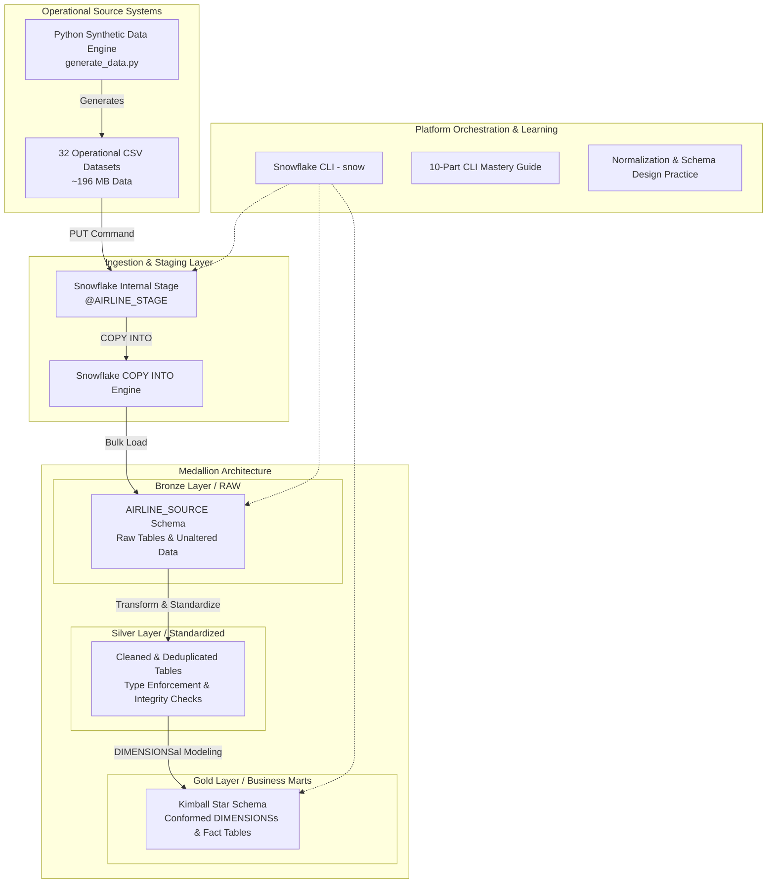

[](https://www.snowflake.com/)
[](https://www.python.org/)
[](https://en.wikipedia.org/wiki/SQL)
[](https://pandas.pydata.org/)
[](https://jupyter.org/)

---

## 📌 Executive Summary

Welcome to the **Snowflake Data Engineering Ecosystem** — a production-inspired, end-to-end repository designed to demonstrate modern data warehousing, scalable ELT pipeline design, Dimensional modeling, automated ingestion, database normalization, and platform administration on **Snowflake**.

This project bridges the gap between theoretical data warehousing concepts and real-world enterprise implementations. Rather than relying on simplified toy datasets, it features a custom-built, highly realistic **Airline Reservation System** operational engine (~196 MB synthetic data across 32 relational entities) alongside dedicated modules for **Database Normalization & Schema Design** and a 10-chapter **Snowflake CLI Mastery Guide**.

---

## 🖼️ Project Banner & Media

https://github.com/user-attachments/assets/9572fa29-61ff-42d5-9edb-20e1883fb01c

> 🎙️ **Project Intro Audio**: [`project_resource/snowflake_project_intro.mp3`](project_resource/snowflake_project_intro.mp3)
> 🎥 **Demo Video**: [`project_resource/snowproject_demo_video.mp4`](project_resource/snowproject_demo_video.mp4)
> 📜 **Narrative Script**: [`project_resource/script.txt`](project_resource/script.txt)

---

## 🏗️ Enterprise Data Platform Architecture

The data architecture follows a modern **Medallion Architecture (Bronze → Silver → Gold)** pattern powered by Snowflake’s cloud data platform:



---

## 📂 Core Repository Modules

```
Snowflake-Data-Engineering-Project/
├── Full-Load-ELT-Data-Warehouse/       # End-to-End Airline Reservation ELT Data Warehouse
│   ├── extract_data/                   # Data generation, metadata & synthetic operational CSVs
│   │   ├── airline_reservation_dataset/# 32 relational CSV tables (~196MB) & Metadata.md
│   │   ├── generator/                  # Python generator script (generate_data.py)
│   │   └── data_profile_for_ddl.ipynb  # DDL generation & schema profiling
│   ├── loading_data/                   # Snowflake SQL initialization, DDLs, & COPY INTO scripts
│   │   ├── initialize_database.sql    # Database & Schema creation (RITSKYSNOW.AIRLINE_SOURCE)
│   │   ├── ddl_table.sql              # Table DDLs for all 32 operational tables
│   │   └── data_copy_into.sql         # Stage setup, PUT commands & COPY INTO statements
│   └── data_overview/                  # Data profiling notebooks and summary logs
│       └── data_profiling.ipynb       # Statistical profiling of raw datasets
│
├── database-design-normalization/       # Relational Database Normalization & Modeling
│   ├── dataset_overview/              # Schema explorations (e.g. customers.sql)
│   ├── first_normalization_checks/    # 1NF validation & normalization checks
│   ├── staging/                       # Database design SQL scripts for NORMALIZE_DW
│   └── normalization_practice_dataset/# Practice datasets (Raw, 1NF-5NF, BCNF, DKNF, Temporal)
│
├── learning_files/                      # Snowflake CLI Mastery Guide (10 Comprehensive Modules)
│   ├── 01_Introduction.md             # Snowflake CLI architecture & concepts
│   ├── 02_Installation_and_Configuration.md
│   ├── 03_All_Snowflake_CLI_Commands.md
│   ├── 04_Database_Administration.md
│   ├── 05_Data_Engineering_Workflow.md# ELT, Snowpipe, Tasks, Streams & Orchestration
│   ├── 06_Python_SDK_and_API.md
│   ├── 07_Project_Examples.md         # End-to-end terminal workflows
│   ├── 08_Best_Practices.md           # Security, DevOps, CI/CD, Cost Optimization
│   ├── 09_Troubleshooting.md          # Debugging & CLI error resolution
│   └── 10_Command_Cheat_Sheet.md      # Command reference guide
│
├── project_resource/                    # Project media, voiceover scripts & banners
└── README.md                            # Executive Project Documentation
```

---

## 📊 Module Highlights

### 1. 🛫 Full-Load ELT Data Warehouse (`Full-Load-ELT-Data-Warehouse/`)
Simulates the core operational and analytical engine of an airline enterprise.
- **32 Relational Tables**: Reference data, customer data, flight operations, bookings, payments, customer support, and baggage.
- **Data Quality Anomaly Simulation**: Incorporates real-world dirty data patterns (missing values, inconsistent country names like `United States`/`USA`, trailing whitespace, mixed phone number formats, and duplicate emails) to practice robust SQL transformation.
- **Automated Python Generator**: Reproducible data generation using fixed seed (`seed=42`).

### 2. 📐 Database Design & Normalization (`database-design-normalization/`)
Focuses on database normalization rigor and relational schema optimization:
- Practical scripts for First Normal Form (1NF) checks (`customers_1nf_check.sql`).
- Hand-crafted datasets covering advanced normal forms: **BCNF**, **4NF (Multivalued Dependencies)**, **5NF (Join Dependencies)**, **DKNF**, **EKNF**, **ETNF**, and **Temporal Schemas**.
- DDL designs for structured DIMENSIONSal and staging layouts (`NORMALIZE_DW`).

### 3. 📖 Snowflake CLI Mastery Guide (`learning_files/`)
A 10-chapter reference guide for platform engineers and data engineers:
- CLI installation, named connection management (`config.toml`), and non-interactive execution.
- Object management, declarative project deployment (`snowflake.yml`), Streamlit-in-Snowflake, Snowpark deployment, and Native Apps.
- Cost management, role-based access control (RBAC), monitoring, and CI/CD automation via GitHub Actions.

---

## ⚡ Quickstart & Deployment Guide

### Prerequisites
- **Snowflake Account** (Enterprise or Trial edition with `SYSADMIN` / `ACCOUNTADMIN` access)
- **Snowflake CLI** (`snow`) or SQL Client / Snowsight
- **Python 3.8+** with `pandas` and `numpy` (if regenerating synthetic datasets)

---

### Step 1: Clone Repository & Environment Setup
```bash
git clone https://github.com/Ritik-DataEngine/Snowflake-Data-Engineering-Project.git
cd Snowflake-Data-Engineering-Project
```

---

### Step 2: Initialize Snowflake Database & Schemas
Execute `Full-Load-ELT-Data-Warehouse/loading_data/initialize_database.sql` in Snowflake:
```sql
USE ROLE ACCOUNTADMIN;
GRANT USAGE ON DATABASE RITSKYSNOW TO ROLE SYSADMIN;
GRANT CREATE SCHEMA ON DATABASE RITSKYSNOW TO ROLE SYSADMIN;

USE ROLE SYSADMIN;
CREATE DATABASE IF NOT EXISTS RITSKYSNOW COMMENT = 'RitSky Retail & Airline Analytics Data Warehouse';
USE DATABASE RITSKYSNOW;
CREATE SCHEMA IF NOT EXISTS AIRLINE_SOURCE COMMENT = 'Raw operational source data layer';
```

---

### Step 3: Create Tables (DDL Execution)
Run `Full-Load-ELT-Data-Warehouse/loading_data/ddl_table.sql` to instantiate DDLs for all 32 operational tables under `RITSKYSNOW.AIRLINE_SOURCE`.

---

### Step 4: Data Ingestion (Internal Stage & COPY INTO)
Using Snowflake CLI or SnowSQL, upload raw CSV files and load into staging tables:

```sql
USE DATABASE RITSKYSNOW;
USE SCHEMA AIRLINE_SOURCE;

-- Create Named Internal Stage
CREATE OR REPLACE STAGE AIRLINE_STAGE;

-- Upload Files (SnowSQL / CLI PUT)
PUT 'file://./Full-Load-ELT-Data-Warehouse/extract_data/airline_reservation_dataset/data/*.csv'
@AIRLINE_STAGE AUTO_COMPRESS = TRUE;

-- Bulk Load Execution
COPY INTO AIRCRAFT FROM @AIRLINE_STAGE/aircraft.csv.gz FILE_FORMAT = (TYPE = 'CSV' SKIP_HEADER = 1);
-- (See data_copy_into.sql for complete COPY INTO commands across all 32 entities)
```

---

## 🛠️ Technology Stack

| Domain | Tools & Technologies |
|---|---|
| **Data Platform** | Snowflake (Cloud Data Platform, Internal Stages, Virtual Warehouses) |
| **Orchestration & Tooling** | Snowflake CLI (`snow`), SnowSQL, Bash, Git |
| **Languages** | SQL (Snowflake Dialect), Python 3.x |
| **Libraries** | Pandas, NumPy, Jupyter Notebooks |
| **Data Modeling** | Medallion Architecture, Kimball Dimensional Star Schema, Normalization (1NF–5NF) |

---

## 🗺️ Project Roadmap & Future Enhancements

- [x] **Full-Load Bulk Ingestion**: Staging CSV exports via Snowflake Named Stages and `COPY INTO`.
- [x] **Synthetic Data Generator**: Multi-table relational engine producing realistic operational data.
- [x] **Database Normalization Suite**: Practical exercises for 1NF through 5NF/DKNF.
- [x] **CLI Documentation**: Complete 10-chapter Snowflake CLI guide.
- [ ] **Silver & Gold Layer Pipeline**: Build automated SQL transformations and dynamic tables for Silver/Gold schema layers.
- [ ] **CDC & Incremental Streams**: Implement Snowflake Streams & Tasks for Change Data Capture (CDC).
- [ ] **Data Quality Quality Gates**: Automate data validation checks with dbt or Snowflake Data Quality rules.
- [ ] **CI/CD Pipeline**: Integrate GitHub Actions for automated snowflake deployments using `snow dcm` / `snowflake.yml`.

---

## 👨‍💻 Author & Acknowledgments

Built with ❤️ by **Ritik** as part of an ongoing journey to master Snowflake, modern data engineering architectures, and production platform design.

- **GitHub**: [@Ritik-DataEngine](https://github.com/Ritik574-coder)

---

## 📄 License

This repository is licensed under the [MIT License](LICENSE).
