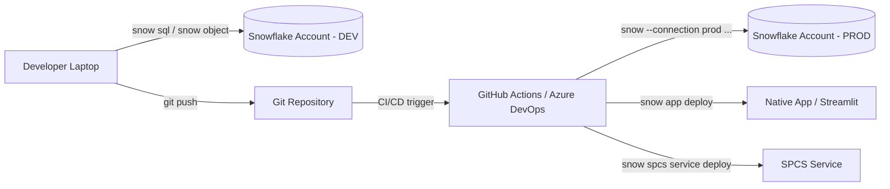
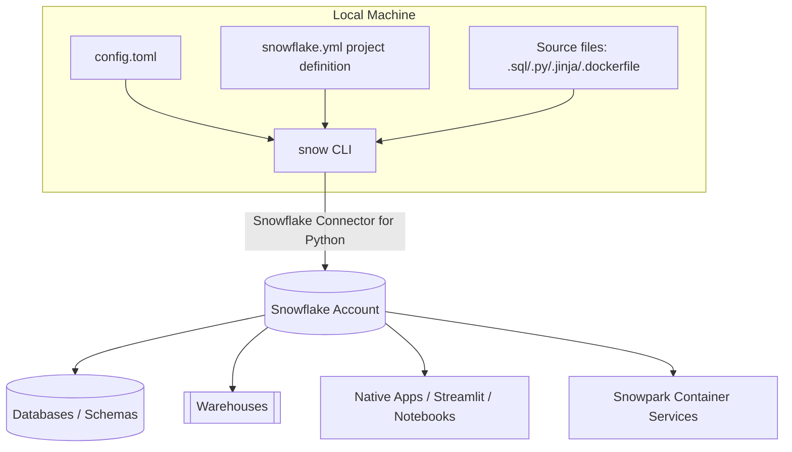

# Snowflake CLI Mastery Guide

## 01 — Introduction

> **Series:** Snowflake CLI — From Beginner to Production
> **Files in this series:** `01_Introduction.md` → `10_Command_Cheat_Sheet.md`
> **Audience:** Data Engineers, Analytics Engineers, Platform/DevOps Engineers, Snowflake Administrators, ML Engineers
> **Scope:** Snowflake CLI (the `snow` binary), open-sourced and maintained by Snowflake, covering SQL execution, object management, Snowpark, Native Apps, Streamlit, Notebooks, Git integration, Snowpark Container Services (SPCS), dbt projects, DCM (declarative project management), Cortex, and CI/CD automation.

---

## 1. What Is Snowflake CLI

Snowflake CLI (invoked as `snow`) is Snowflake's **official, open-source, unified command-line interface** for developer-centric workloads. It replaces and extends the legacy `snowsql` client, which was SQL-execution only.

Where `snowsql` gave you a SQL prompt, `snow` gives you an **entire platform automation surface**:

| Capability                                                           | Supported via       |
| -------------------------------------------------------------------- | ------------------- |
| Run ad-hoc and scripted SQL                                          | `snow sql`          |
| Manage any Snowflake object (table, warehouse, task, stream, etc.)   | `snow object`       |
| Manage stages and file uploads/downloads                             | `snow stage`        |
| Build & deploy Python UDFs/UDTFs/Procedures (Snowpark)               | `snow snowpark`     |
| Deploy Streamlit-in-Snowflake apps                                   | `snow streamlit`    |
| Manage Snowflake Notebooks                                           | `snow notebook`     |
| Build, version, and publish Snowflake Native Apps                    | `snow app`          |
| Integrate with Git repositories as a first-class Snowflake object    | `snow git`          |
| Manage Snowpark Container Services (compute pools, services, images) | `snow spcs`         |
| Manage dbt Projects natively inside Snowflake                        | `snow dbt`          |
| Manage declarative projects (DCM)                                    | `snow dcm`          |
| Run Cortex AI functions from the terminal                            | `snow cortex`       |
| Validate custom container images                                     | `snow custom-image` |
| Retrieve structured logs from services/functions                     | `snow logs`         |
| Manage named connections & authentication                            | `snow connection`   |

**Design philosophy:** Snowflake CLI is built to be **scriptable, idempotent where possible, CI/CD-friendly, and declarative** through project definition files (`snowflake.yml`), rather than being a purely interactive shell like `snowsql`.

---

## 2. Why Snowflake CLI Matters for Data Engineering

Modern data platforms are expected to be:

- **Version-controlled** — every schema, task, and pipeline definition lives in Git.
- **Reproducible** — the same commands must produce the same state in dev, staging, and prod.
- **Automatable** — deployments run in GitHub Actions/Azure DevOps/Jenkins, not by a human clicking "Run" in the UI.
- **Auditable** — every change is a diffable, reviewable commit, not a UI click nobody remembers.

Snowflake CLI is the tool that closes the gap between "I built this in the Snowsight UI" and "this is deployed the same way every time, from a pipeline, with no human in the loop."

---

## 3. Snowflake CLI vs. SnowSQL vs. Snowsight UI

| DIMENSIONS                                        | Snowflake CLI (`snow`)                     | SnowSQL (`snowsql`)                  | Snowsight (Web UI)                        |
| ------------------------------------------------- | ------------------------------------------ | ------------------------------------ | ----------------------------------------- |
| Primary purpose                                   | Full developer + DevOps automation surface | SQL execution only                   | Interactive exploration & visualization   |
| Scriptable / CI-CD friendly                       | ✅ Native, designed for it                  | ⚠️ Possible but clunky               | ❌ Manual only                             |
| Manages Streamlit apps                            | ✅ `snow streamlit`                         | ❌                                    | ✅ (create/edit only)                      |
| Manages Native Apps                               | ✅ `snow app`                               | ❌                                    | ⚠️ Partial                                |
| Manages Snowpark code (UDF/Proc)                  | ✅ `snow snowpark`                          | ❌                                    | ⚠️ Partial                                |
| Manages SPCS (containers)                         | ✅ `snow spcs`                              | ❌                                    | ⚠️ Partial                                |
| Git-integrated deployments                        | ✅ `snow git`                               | ❌                                    | ⚠️ Partial (Git integration objects only) |
| Declarative project definitions (`snowflake.yml`) | ✅                                          | ❌                                    | ❌                                         |
| Config file format                                | TOML (`config.toml`)                       | INI-like config                      | N/A (browser session)                     |
| Open source                                       | ✅ (Apache 2.0, GitHub)                     | ❌ (closed distribution)              | ❌                                         |
| Actively developed                                | ✅ Primary investment                       | ⚠️ Maintenance mode                  | ✅                                         |
| Best for                                          | Automated pipelines, IaC, app deployment   | Legacy scripts, quick SQL batch jobs | Exploration, dashboards, ad-hoc analysis  |

> **Practical guidance:** For any **new** project in 2026, use Snowflake CLI. SnowSQL is in maintenance mode — Snowflake recommends migrating existing SnowSQL scripts to `snow sql`. The two tools share very similar config concepts (named connections, variable substitution) which makes migration straightforward.

---

## 4. Architecture Overview

Snowflake CLI is a Python-based CLI (built on Typer/Click internally) that:

1. Reads a **connection configuration** from `config.toml` (or command-line overrides / environment variables).
2. Authenticates using one of several supported methods (password, key-pair, SSO/external browser, OAuth, MFA, workload identity federation).
3. Talks to Snowflake via the **Snowflake Connector for Python** under the hood.
4. Optionally reads a **project definition file** (`snowflake.yml`) that declares the artifacts (Streamlit app, Native App, Snowpark functions, dbt project, etc.) to be built and deployed.
5. Executes SQL/DDL/API calls and streams results back to the terminal in `TABLE`, `JSON`, `JSON_EXT`, or `CSV` format.

---

## 5. Who This Guide Is For

| Role                         | What you'll get from this guide                                                                             |
| ---------------------------- | ----------------------------------------------------------------------------------------------------------- |
| **Data Engineer**            | Build ELT pipelines, manage stages/tasks/streams/dynamic tables entirely from terminal, automate with CI/CD |
| **Analytics Engineer**       | Deploy and version dbt-on-Snowflake projects and DCM declarative projects                                   |
| **Snowflake Administrator**  | Manage users, roles, warehouses, resource monitors, and network policies via scripted SQL                   |
| **ML/Data Scientist**        | Deploy Snowpark Python models, manage Notebooks, run Cortex AI functions from scripts                       |
| **DevOps/Platform Engineer** | Wire Snowflake CLI into GitHub Actions, Azure DevOps, Terraform-adjacent IaC workflows                      |

---

## 6. How This Documentation Set Is Organized

| File                                   | Contents                                                                                                                                                                                           |
| -------------------------------------- | -------------------------------------------------------------------------------------------------------------------------------------------------------------------------------------------------- |
| `01_Introduction.md`                   | This file — concepts, architecture, positioning                                                                                                                                                    |
| `02_Installation_and_Configuration.md` | Install, upgrade, `config.toml`, authentication methods, `snow connection`, `snow init`                                                                                                            |
| `03_All_Snowflake_CLI_Commands.md`     | Exhaustive command reference — every command group, every flag                                                                                                                                     |
| `04_Database_Administration.md`        | Databases, schemas, warehouses, users, roles, resource monitors, network policies via CLI                                                                                                          |
| `05_Data_Engineering_Workflow.md`      | Stages, file formats, Snowpipe, tasks, streams, d/home/ritik/Snowflake-Data-Engineering-Project/database-design-normalization/third_normalization/customers_3nf.sqlynamic tables, ELT/ETL patterns |
| `06_Python_SDK_and_API.md`             | Snowflake Connector, Snowpark Python, Python APIs, automation scripting                                                                                                                            |
| `07_Project_Examples.md`               | End-to-end real-world terminal workflows and CI/CD pipelines                                                                                                                                       |
| `08_Best_Practices.md`                 | Enterprise folder structure, naming, security, Git workflow, monitoring                                                                                                                            |
| `09_Troubleshooting.md`                | Common errors, root causes, fixes, diagnostics                                                                                                                                                     |
| `10_Command_Cheat_Sheet.md`            | One-page quick reference                                                                                                                                                                           |

---

## 7. Conventions Used in This Guide

- Commands are shown as they'd be typed in a POSIX shell (bash/zsh). Windows PowerShell equivalents are noted where syntax differs.
- `$` at the start of a line denotes a shell prompt; it is **not** part of the command.
- Fenced blocks after a command show **representative** terminal output. Exact formatting (column widths, timestamps, IDs) will vary by account.
- Placeholders are wrapped in angle brackets, e.g. `<database_name>`, `<connection_name>`.

> **📌 Note**
> Snowflake CLI is under active development. Command surfaces evolve across minor versions. Always cross-check against `snow <command> --help` and the official release notes for your installed version. This guide reflects the CLI's command structure as of mid-2026 (2.x line).

> **💡 Tip**
> Run `snow --info` at any time to get a JSON dump of your CLI version, Python version, and OS — invaluable when filing a bug or comparing environments in CI vs. local.

Continue to `02_Installation_and_Configuration.md` to get `snow` installed and your first connection working.