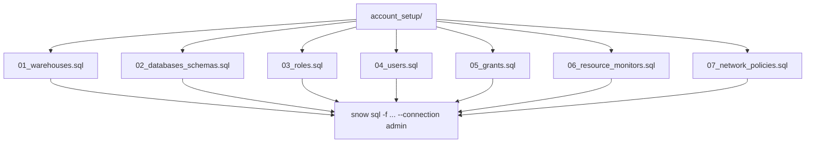
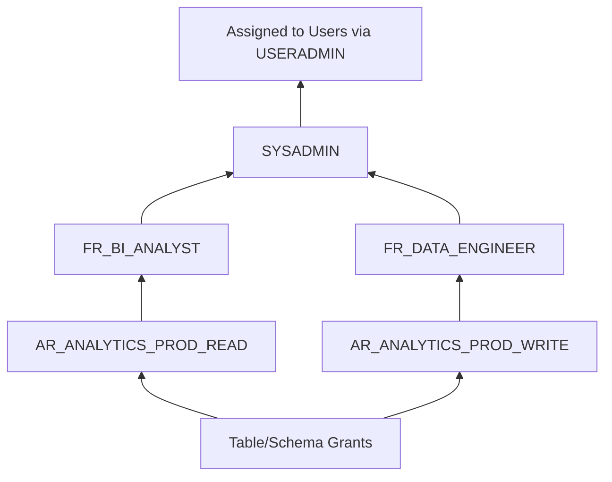

# Snowflake CLI Mastery Guide

## 04 — Database Administration from the Terminal

> This file shows how to perform core Snowflake administration — databases, schemas, warehouses, users, roles, resource monitors, network policies, and security — entirely through `snow sql` and `snow object`, so administration can live in version control instead of Snowsight click-ops.

---

## 1. Administration Philosophy: SQL-as-Code

Snowflake CLI does not reinvent SQL DDL — it **executes** it. For administration, the pattern is almost always:

```bash
snow sql -f admin/<object>.sql --connection admin_conn
```

Keep DDL in versioned `.sql` files (idempotent with `CREATE ... IF NOT EXISTS` or `CREATE OR ALTER` where supported), and use `snow object` for quick reads/inventory. This section gives copy-pasteable, production-grade scripts for each core object type.



---

## 2. Databases and Schemas

### Create

```bash
snow sql -q "
CREATE DATABASE IF NOT EXISTS ANALYTICS_PROD
  DATA_RETENTION_TIME_IN_DAYS = 7
  COMMENT = 'Production analytics database — owned by Data Platform team';

CREATE SCHEMA IF NOT EXISTS ANALYTICS_PROD.STAGING
  DATA_RETENTION_TIME_IN_DAYS = 1
  COMMENT = 'Raw/staging landing zone';

CREATE SCHEMA IF NOT EXISTS ANALYTICS_PROD.CORE
  DATA_RETENTION_TIME_IN_DAYS = 7
  COMMENT = 'Conformed DIMENSIONSal/fact models';

CREATE SCHEMA IF NOT EXISTS ANALYTICS_PROD.MARTS
  DATA_RETENTION_TIME_IN_DAYS = 7
  COMMENT = 'Business-facing marts';
" --connection admin_conn
```

### Inventory

```bash
snow object list database --like "ANALYTICS%"
snow object list schema --in database ANALYTICS_PROD
```

```
+---------------------------------------------------------------+
| name     | database_name | owner              | ...           |
|----------|----------------|---------------------|---------------|
| STAGING  | ANALYTICS_PROD | SYSADMIN            | ...           |
| CORE     | ANALYTICS_PROD | SYSADMIN            | ...           |
| MARTS    | ANALYTICS_PROD | SYSADMIN            | ...           |
+---------------------------------------------------------------+
```

### Clone (Zero-Copy) for Environment Refresh

```bash
snow sql -q "CREATE DATABASE ANALYTICS_STAGING CLONE ANALYTICS_PROD;" --connection admin_conn
```

> **💡 Tip**
> Zero-copy cloning is one of the highest-leverage CLI-scriptable operations for data engineering: refresh a full staging/QA environment from prod in seconds without duplicating storage, then run your dbt/DCM test suite against a prod-like copy in CI.

### Drop (with Guardrails)

```bash
snow sql -q "DROP DATABASE IF EXISTS ANALYTICS_STAGING_OLD;" --connection admin_conn --enhanced-exit-codes
```

> **⚠️ Warning**
> Never wire a `DROP DATABASE`/`DROP SCHEMA` command to a CI trigger without an explicit manual-approval gate. Use `UNDROP DATABASE <name>;` via `snow sql` within the Time Travel retention window to recover from accidental drops.

---

## 3. Warehouses

### Create — Sized for Workload

```bash
snow sql -q "
CREATE WAREHOUSE IF NOT EXISTS WH_ELT_PROD
  WAREHOUSE_SIZE = 'MEDIUM'
  AUTO_SUSPEND = 60
  AUTO_RESUME = TRUE
  INITIALLY_SUSPENDED = TRUE
  MIN_CLUSTER_COUNT = 1
  MAX_CLUSTER_COUNT = 3
  SCALING_POLICY = 'STANDARD'
  COMMENT = 'ELT batch loads and dbt runs';
" --connection admin_conn
```

### Warehouse Sizing Guidance

| Size | vCPU-equivalent multiplier | Typical use |
|---|---|---|
| X-Small | 1x | Dev/CI smoke tests, tiny lookups |
| Small | 2x | Light BI dashboards, small ELT |
| Medium | 4x | Standard ELT/dbt runs |
| Large | 8x | Heavy transformation, wide joins |
| X-Large+ | 16x–512x | Large-scale batch, ML feature engineering |

### Multi-Cluster for Concurrency (not size)

```bash
snow sql -q "
ALTER WAREHOUSE WH_BI_PROD SET
  MIN_CLUSTER_COUNT = 1
  MAX_CLUSTER_COUNT = 5
  SCALING_POLICY = 'ECONOMY';
" --connection admin_conn
```

### Inventory and Monitoring

```bash
snow object list warehouse --like "WH_%"
snow sql -q "SELECT * FROM TABLE(INFORMATION_SCHEMA.WAREHOUSE_LOAD_HISTORY(
  DATE_RANGE_START=>DATEADD('hour',-24,CURRENT_TIMESTAMP()),
  WAREHOUSE_NAME=>'WH_ELT_PROD'));" --format json
```

### Warehouse vs. Compute Pool (SPCS)

| DIMENSIONS | Virtual Warehouse | SPCS Compute Pool |
|---|---|---|
| Workload type | SQL, Snowpark UDF/procedure execution | Arbitrary containers, GPU workloads |
| Billing granularity | Per-second, auto-suspend/resume | Per-second, per-node |
| Scaling | Multi-cluster for concurrency, size for throughput | `min-nodes`/`max-nodes` for horizontal scaling |
| CLI management | `snow sql` (DDL), `snow object` | `snow spcs compute-pool` |

---

## 4. Roles and RBAC

### Role Hierarchy Pattern (Functional Roles → Access Roles)



```bash
snow sql -f admin/roles/01_access_roles.sql --connection admin_conn
```

`01_access_roles.sql`:
```sql
-- Access roles: map 1:1 to a privilege grant bundle
CREATE ROLE IF NOT EXISTS AR_ANALYTICS_PROD_READ;
CREATE ROLE IF NOT EXISTS AR_ANALYTICS_PROD_WRITE;

GRANT USAGE ON DATABASE ANALYTICS_PROD TO ROLE AR_ANALYTICS_PROD_READ;
GRANT USAGE ON ALL SCHEMAS IN DATABASE ANALYTICS_PROD TO ROLE AR_ANALYTICS_PROD_READ;
GRANT SELECT ON ALL TABLES IN DATABASE ANALYTICS_PROD TO ROLE AR_ANALYTICS_PROD_READ;
GRANT SELECT ON FUTURE TABLES IN DATABASE ANALYTICS_PROD TO ROLE AR_ANALYTICS_PROD_READ;

GRANT ALL ON SCHEMA ANALYTICS_PROD.STAGING TO ROLE AR_ANALYTICS_PROD_WRITE;
GRANT ALL ON FUTURE TABLES IN SCHEMA ANALYTICS_PROD.STAGING TO ROLE AR_ANALYTICS_PROD_WRITE;

-- Functional roles: assigned to humans/service accounts
CREATE ROLE IF NOT EXISTS FR_BI_ANALYST;
CREATE ROLE IF NOT EXISTS FR_DATA_ENGINEER;

GRANT ROLE AR_ANALYTICS_PROD_READ TO ROLE FR_BI_ANALYST;
GRANT ROLE AR_ANALYTICS_PROD_READ TO ROLE FR_DATA_ENGINEER;
GRANT ROLE AR_ANALYTICS_PROD_WRITE TO ROLE FR_DATA_ENGINEER;

GRANT ROLE FR_BI_ANALYST TO ROLE SYSADMIN;
GRANT ROLE FR_DATA_ENGINEER TO ROLE SYSADMIN;
```

> **✅ Best Practice**
> Separate **access roles** (privilege bundles tied to an object domain) from **functional roles** (assigned to people/service accounts). This decouples "what a role can do" from "who has that role," and lets you re-point functional roles to new access-role bundles without re-granting hundreds of object-level privileges.

### Inventory

```bash
snow object list role --like "FR_%"
snow sql -q "SHOW GRANTS TO ROLE FR_DATA_ENGINEER;"
snow sql -q "SHOW GRANTS OF ROLE FR_DATA_ENGINEER;"
```

---

## 5. Users and Service Accounts

### Human User

```bash
snow sql -q "
CREATE USER IF NOT EXISTS jdoe
  LOGIN_NAME = 'jdoe'
  DISPLAY_NAME = 'Jane Doe'
  EMAIL = 'jdoe@example.com'
  DEFAULT_ROLE = 'FR_DATA_ENGINEER'
  DEFAULT_WAREHOUSE = 'WH_ELT_PROD'
  MUST_CHANGE_PASSWORD = FALSE
  TYPE = 'PERSON';
GRANT ROLE FR_DATA_ENGINEER TO USER jdoe;
" --connection admin_conn
```

### Service Account (Key-Pair Auth, No Password)

```bash
snow sql -q "
CREATE USER IF NOT EXISTS svc_dbt_prod
  DEFAULT_ROLE = 'FR_DATA_ENGINEER'
  DEFAULT_WAREHOUSE = 'WH_ELT_PROD'
  TYPE = 'SERVICE'
  RSA_PUBLIC_KEY = '$(cat svc_dbt_prod_public_key.txt)'
  COMMENT = 'dbt Cloud/CI production service account — key-pair only, no interactive login';
GRANT ROLE FR_DATA_ENGINEER TO USER svc_dbt_prod;
" --connection admin_conn
```

> **✅ Best Practice**
> Always set `TYPE = 'SERVICE'` (or `TYPE = 'LEGACY_SERVICE'` depending on your account's policy generation) for non-human accounts. This exempts them from human-oriented authentication policies (password rotation, MFA enforcement) while still allowing tight, auditable network/authentication policy scoping.

### Rotate a Service Account Key (Zero-Downtime)

```bash
# 1. Generate new key pair, register as the SECONDARY key
snow sql -q "ALTER USER svc_dbt_prod SET RSA_PUBLIC_KEY_2='$(cat new_key.pub)';" --connection admin_conn
# 2. Update CI secret to use new private key, verify
snow connection test --connection prod
# 3. Remove old primary key, promote secondary
snow sql -q "ALTER USER svc_dbt_prod UNSET RSA_PUBLIC_KEY; ALTER USER svc_dbt_prod SET RSA_PUBLIC_KEY='$(cat new_key.pub)'; ALTER USER svc_dbt_prod UNSET RSA_PUBLIC_KEY_2;" --connection admin_conn
```

### Inventory / Audit

```bash
snow sql -q "SELECT name, type, disabled, last_success_login, default_role
             FROM SNOWFLAKE.ACCOUNT_USAGE.USERS WHERE deleted_on IS NULL;" --format csv > user_audit.csv
```

---

## 6. Resource Monitors (Cost Governance)

```bash
snow sql -q "
CREATE RESOURCE MONITOR IF NOT EXISTS RM_ELT_MONTHLY
  WITH CREDIT_QUOTA = 500
  FREQUENCY = MONTHLY
  START_TIMESTAMP = IMMEDIATELY
  TRIGGERS
    ON 75 PERCENT DO NOTIFY
    ON 90 PERCENT DO NOTIFY
    ON 100 PERCENT DO SUSPEND
    ON 110 PERCENT DO SUSPEND_IMMEDIATE;

ALTER WAREHOUSE WH_ELT_PROD SET RESOURCE_MONITOR = RM_ELT_MONTHLY;
" --connection admin_conn
```

```bash
snow sql -q "SHOW RESOURCE MONITORS;"
```
```
+---------------------------------------------------------------------------+
| name           | credit_quota | used_credits | remaining_credits | level  |
|----------------|--------------|--------------|--------------------|--------|
| RM_ELT_MONTHLY | 500          | 187.42       | 312.58             | ACCOUNT|
+---------------------------------------------------------------------------+
```

> **✅ Best Practice**
> Set resource monitors on **every** non-trivial warehouse before it goes to production. A misconfigured Task loop or an analyst's runaway query with no `AUTO_SUSPEND` has burned real budgets — a resource monitor with a `SUSPEND` trigger is cheap insurance.

---

## 7. Network Policies

```bash
snow sql -q "
CREATE NETWORK POLICY IF NOT EXISTS NP_CORP_AND_CI
  ALLOWED_IP_LIST = ('203.0.113.0/24', '198.51.100.10/32')
  BLOCKED_IP_LIST = ()
  COMMENT = 'Corporate VPN range + GitHub Actions egress IP';

ALTER USER svc_dbt_prod SET NETWORK_POLICY = NP_CORP_AND_CI;
" --connection admin_conn
```

> **⚠️ Warning**
> Applying a network policy at the **account** level (`ALTER ACCOUNT SET NETWORK_POLICY = ...`) locks out anyone outside the allow-list immediately, including yourself if your current IP isn't included. Always test at the **user** level first, and keep an emergency `ACCOUNTADMIN` session/IP documented before an account-level rollout.

### Inventory

```bash
snow object list network-policy
snow sql -q "SHOW PARAMETERS LIKE 'NETWORK_POLICY' IN ACCOUNT;"
```

---

## 8. Governance: Masking Policies, Row Access Policies, Tags

```bash
snow sql -q "
CREATE MASKING POLICY IF NOT EXISTS MP_EMAIL_MASK AS (val STRING) RETURNS STRING ->
  CASE
    WHEN CURRENT_ROLE() IN ('FR_DATA_ENGINEER', 'ACCOUNTADMIN') THEN val
    ELSE REGEXP_REPLACE(val, '.+@', '***@')
  END;

ALTER TABLE ANALYTICS_PROD.CORE.CUSTOMERS
  MODIFY COLUMN EMAIL SET MASKING POLICY MP_EMAIL_MASK;
" --connection admin_conn
```

```bash
snow sql -q "
CREATE TAG IF NOT EXISTS ANALYTICS_PROD.CORE.PII_TAG;
ALTER TABLE ANALYTICS_PROD.CORE.CUSTOMERS
  MODIFY COLUMN EMAIL SET TAG PII_TAG = 'sensitive';
" --connection admin_conn
```

---

## 9. Putting It Together: `snow sql` vs. `snow dcm` vs. `snow object` for Admin

| Task Type | Recommended Tool |
|---|---|
| One-off DDL / imperative script (this file's examples) | `snow sql -f` |
| Full account/environment provisioning with plan/diff and drift detection | `snow dcm` (see `03` §12) |
| Quick inventory, audit, ad-hoc drop | `snow object` |
| Bulk data movement into/out of stages | `snow stage copy` |

---

## 10. Enterprise Folder Layout for Admin Scripts

```
account-admin/
├── connections/
│   └── config.toml.example          # sanitized template, real file is gitignored
├── warehouses/
│   ├── 01_elt_warehouses.sql
│   └── 02_bi_warehouses.sql
├── databases/
│   ├── 01_analytics_prod.sql
│   └── 02_analytics_dev.sql
├── roles/
│   ├── 01_access_roles.sql
│   └── 02_functional_roles.sql
├── users/
│   └── 01_service_accounts.sql
├── governance/
│   ├── masking_policies.sql
│   └── row_access_policies.sql
├── resource_monitors/
│   └── 01_monitors.sql
├── network_policies/
│   └── 01_network_policies.sql
└── deploy.sh                        # orchestrates snow sql -f calls in order
```

`deploy.sh`:
```bash
#!/usr/bin/env bash
set -euo pipefail
CONN="${1:-admin_conn}"

for f in warehouses/*.sql databases/*.sql roles/*.sql users/*.sql \
         governance/*.sql resource_monitors/*.sql network_policies/*.sql; do
  echo ">>> Applying $f"
  snow sql -f "$f" --connection "$CONN" --single-transaction --enhanced-exit-codes
done
```

Continue to **`05_Data_Engineering_Workflow.md`** for stages, Snowpipe, tasks, streams, and dynamic tables.