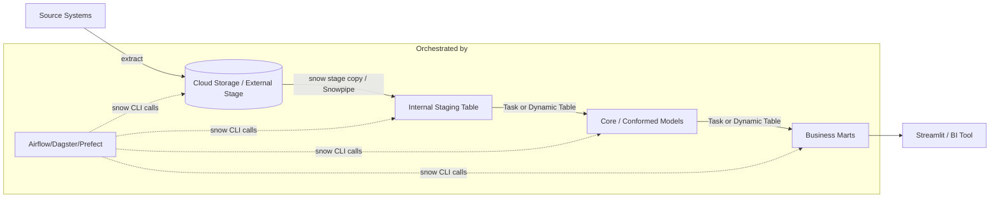
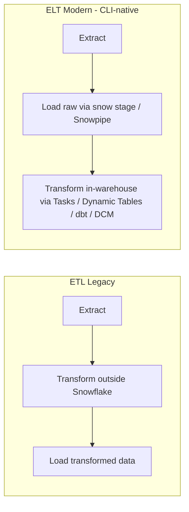

# Snowflake CLI Mastery Guide

## 05 — Data Engineering Workflow: ELT, ETL, Ingestion & Orchestration

---

## 1. The End-to-End Pipeline, CLI-Driven



This file covers every CLI-relevant piece of that diagram: file formats, stages, loading (bulk + Snowpipe + Snowpipe Streaming), transformation (Tasks, Streams, Dynamic Tables), and orchestration integration.

---

## 2. File Formats

```bash
snow sql -q "
CREATE FILE FORMAT IF NOT EXISTS ANALYTICS_PROD.STAGING.FF_CSV_STANDARD
  TYPE = CSV
  FIELD_DELIMITER = ','
  SKIP_HEADER = 1
  FIELD_OPTIONALLY_ENCLOSED_BY = '\"'
  NULL_IF = ('', 'NULL', 'null')
  EMPTY_FIELD_AS_NULL = TRUE
  COMPRESSION = AUTO;

CREATE FILE FORMAT IF NOT EXISTS ANALYTICS_PROD.STAGING.FF_JSON_STANDARD
  TYPE = JSON
  STRIP_OUTER_ARRAY = TRUE
  COMPRESSION = AUTO;

CREATE FILE FORMAT IF NOT EXISTS ANALYTICS_PROD.STAGING.FF_PARQUET
  TYPE = PARQUET;
" --connection prod
```

```bash
snow object list file-format --in schema ANALYTICS_PROD.STAGING
```

---

## 3. Stages: Internal vs. External (Recap + Storage Integration Setup)

### 3.1 External Stage on AWS S3 via Storage Integration

```bash
snow sql -q "
CREATE STORAGE INTEGRATION IF NOT EXISTS SI_S3_RAW_LANDING
  TYPE = EXTERNAL_STAGE
  STORAGE_PROVIDER = 'S3'
  ENABLED = TRUE
  STORAGE_AWS_ROLE_ARN = 'arn:aws:iam::123456789012:role/snowflake-s3-raw-landing'
  STORAGE_ALLOWED_LOCATIONS = ('s3://my-raw-landing-bucket/');
" --connection admin_conn

# Retrieve the Snowflake-side IAM principal to complete the AWS trust relationship
snow sql -q "DESC STORAGE INTEGRATION SI_S3_RAW_LANDING;" --format json
```

```bash
snow sql -q "
CREATE STAGE IF NOT EXISTS ANALYTICS_PROD.STAGING.EXT_RAW_LANDING
  URL = 's3://my-raw-landing-bucket/'
  STORAGE_INTEGRATION = SI_S3_RAW_LANDING
  FILE_FORMAT = ANALYTICS_PROD.STAGING.FF_PARQUET;
" --connection prod
```

### 3.2 Internal Stage + File Upload

```bash
snow stage create @analytics_prod.staging.int_manual_upload --connection prod
snow stage copy ./exports/2026-07-30/*.csv \
  @analytics_prod.staging.int_manual_upload/2026-07-30/ --connection prod
snow stage list-files @analytics_prod.staging.int_manual_upload/2026-07-30/
```

---

## 4. Bulk Loading with `COPY INTO`

```bash
snow sql -q "
COPY INTO ANALYTICS_PROD.STAGING.RAW_ORDERS
FROM @analytics_prod.staging.ext_raw_landing/orders/
FILE_FORMAT = (FORMAT_NAME = 'ANALYTICS_PROD.STAGING.FF_PARQUET')
MATCH_BY_COLUMN_NAME = CASE_INSENSITIVE
ON_ERROR = 'ABORT_STATEMENT'
PURGE = FALSE;
" --connection prod
```

```
+-----------------------------------------------------------------------------------------+
| file                    | status  | rows_parsed | rows_loaded | errors_seen | ...        |
|--------------------------|---------|-------------|-------------|--------------|-----------|
| orders/2026_07_30.parquet| LOADED  | 128400      | 128400      | 0            | ...       |
+-----------------------------------------------------------------------------------------+
```

### `ON_ERROR` Strategy Comparison

| Value | Behavior | Use When |
|---|---|---|
| `ABORT_STATEMENT` | Any error aborts the entire load | High-trust, schema-validated pipelines (default recommendation for prod) |
| `CONTINUE` | Skip bad rows, load the rest | Exploratory/dev loads, tolerant pipelines with downstream quarantine |
| `SKIP_FILE` | Skip the whole file on first error | File-level atomicity requirements |
| `SKIP_FILE_<n>` / `SKIP_FILE_<n>%` | Skip file if error count/percentage exceeds threshold | Mixed-quality batch sources |

---

## 5. Snowpipe (Continuous / Near-Real-Time Ingestion)

```bash
snow sql -q "
CREATE PIPE IF NOT EXISTS ANALYTICS_PROD.STAGING.PIPE_ORDERS
  AUTO_INGEST = TRUE
  AS
  COPY INTO ANALYTICS_PROD.STAGING.RAW_ORDERS
  FROM @analytics_prod.staging.ext_raw_landing/orders/
  FILE_FORMAT = (FORMAT_NAME = 'ANALYTICS_PROD.STAGING.FF_PARQUET')
  MATCH_BY_COLUMN_NAME = CASE_INSENSITIVE;
" --connection prod

snow sql -q "SELECT SYSTEM\$PIPE_STATUS('ANALYTICS_PROD.STAGING.PIPE_ORDERS');" --format json
```
```json
[{"SYSTEM$PIPE_STATUS('ANALYTICS_PROD.STAGING.PIPE_ORDERS')": "{\"executionState\":\"RUNNING\",\"pendingFileCount\":0,\"lastReceivedMessageTimestamp\":\"2026-07-30T10:02:11.203Z\"}"}]
```

> **📌 Note**
> `AUTO_INGEST = TRUE` requires a **notification integration** wired to your cloud provider's event system (S3 Event Notifications → SQS, Azure Event Grid, or GCS Pub/Sub). Create it via `snow sql` before the pipe:
> ```bash
> snow sql -q "CREATE NOTIFICATION INTEGRATION IF NOT EXISTS NI_S3_ORDERS
>   TYPE = QUEUE ENABLED = TRUE
>   NOTIFICATION_PROVIDER = AWS_SQS
>   NOTIFICATION_CHANNEL = 'arn:aws:sqs:us-east-1:123456789012:snowpipe-orders-queue';" --connection admin_conn
> ```

### Snowpipe Streaming (Row-Level, Sub-Second Latency)

Snowpipe Streaming is invoked via the **Snowflake Ingest SDK** (Java/Python) rather than the CLI directly — the CLI's role is limited to provisioning the target table, pipe object (if used in high-performance architecture), and monitoring:

```bash
snow sql -q "SELECT * FROM TABLE(INFORMATION_SCHEMA.PIPE_USAGE_HISTORY(
  DATE_RANGE_START=>DATEADD('hour',-6,CURRENT_TIMESTAMP()),
  PIPE_NAME=>'ANALYTICS_PROD.STAGING.PIPE_ORDERS'));"
```
Programmatic ingestion via the Python Ingest SDK is covered in `06_Python_SDK_and_API.md` §6.

### Snowpipe (Batch/Auto-Ingest) vs. Snowpipe Streaming

| DIMENSIONS | Snowpipe (file-based) | Snowpipe Streaming |
|---|---|---|
| Ingestion unit | Files landed in a stage | Individual rows via SDK |
| Latency | Seconds to ~1 minute | Sub-second to a few seconds |
| Cost model | Per-file/compute-second | Per-byte ingested |
| Typical source | Batch file exports, CDC file dumps | Kafka, application event streams |
| CLI role | Full lifecycle management | Provisioning + monitoring only |

---

## 6. Tasks: Scheduled SQL/Snowpark Orchestration

```bash
snow sql -q "
CREATE TASK IF NOT EXISTS ANALYTICS_PROD.CORE.TASK_REFRESH_CUSTOMERS
  WAREHOUSE = WH_ELT_PROD
  SCHEDULE = 'USING CRON 0 */2 * * * UTC'
  COMMENT = 'Refresh customer DIMENSIONS every 2 hours'
  AS
  MERGE INTO ANALYTICS_PROD.CORE.CUSTOMERS AS tgt
  USING ANALYTICS_PROD.STAGING.RAW_CUSTOMERS AS src
  ON tgt.customer_id = src.customer_id
  WHEN MATCHED THEN UPDATE SET tgt.name = src.name, tgt.updated_at = CURRENT_TIMESTAMP()
  WHEN NOT MATCHED THEN INSERT (customer_id, name, updated_at)
    VALUES (src.customer_id, src.name, CURRENT_TIMESTAMP());

ALTER TASK ANALYTICS_PROD.CORE.TASK_REFRESH_CUSTOMERS RESUME;
" --connection prod
```

### Task DAGs (Predecessor Chaining)

```bash
snow sql -q "
CREATE TASK IF NOT EXISTS ANALYTICS_PROD.CORE.TASK_BUILD_MART
  WAREHOUSE = WH_ELT_PROD
  AFTER ANALYTICS_PROD.CORE.TASK_REFRESH_CUSTOMERS
  AS
  CALL ANALYTICS_PROD.CORE.SP_BUILD_CUSTOMER_MART();

ALTER TASK ANALYTICS_PROD.CORE.TASK_BUILD_MART RESUME;
"
```

```bash
snow sql -q "SELECT * FROM TABLE(INFORMATION_SCHEMA.TASK_HISTORY(
  TASK_NAME=>'TASK_REFRESH_CUSTOMERS', RESULT_LIMIT=>20));"
```

---

## 7. Streams: Change Data Capture

```bash
snow sql -q "
CREATE STREAM IF NOT EXISTS ANALYTICS_PROD.STAGING.STRM_RAW_ORDERS
  ON TABLE ANALYTICS_PROD.STAGING.RAW_ORDERS
  APPEND_ONLY = FALSE
  SHOW_INITIAL_ROWS = FALSE;
" --connection prod
```

```bash
snow sql -q "SELECT SYSTEM\$STREAM_HAS_DATA('ANALYTICS_PROD.STAGING.STRM_RAW_ORDERS');"
```

Consume the stream inside a Task so only-changed rows are processed each run:

```sql
CREATE TASK IF NOT EXISTS ANALYTICS_PROD.CORE.TASK_APPLY_ORDER_CHANGES
  WAREHOUSE = WH_ELT_PROD
  SCHEDULE = '5 MINUTE'
  WHEN SYSTEM$STREAM_HAS_DATA('ANALYTICS_PROD.STAGING.STRM_RAW_ORDERS')
  AS
  MERGE INTO ANALYTICS_PROD.CORE.ORDERS AS tgt
  USING ANALYTICS_PROD.STAGING.STRM_RAW_ORDERS AS src
  ON tgt.order_id = src.order_id
  WHEN MATCHED AND src.METADATA$ACTION = 'DELETE' THEN DELETE
  WHEN MATCHED THEN UPDATE SET tgt.status = src.status
  WHEN NOT MATCHED AND src.METADATA$ACTION = 'INSERT' THEN INSERT (order_id, status)
    VALUES (src.order_id, src.status);
```

---

## 8. Dynamic Tables: Declarative Incremental Transformation

```bash
snow sql -q "
CREATE OR REPLACE DYNAMIC TABLE ANALYTICS_PROD.CORE.CUSTOMER_360
  TARGET_LAG = '15 minutes'
  WAREHOUSE = WH_ELT_PROD
  AS
  SELECT
    c.customer_id,
    c.name,
    COUNT(o.order_id) AS lifetime_orders,
    SUM(o.amount) AS lifetime_value
  FROM ANALYTICS_PROD.CORE.CUSTOMERS c
  LEFT JOIN ANALYTICS_PROD.CORE.ORDERS o ON o.customer_id = c.customer_id
  GROUP BY 1, 2;
" --connection prod
```

```bash
snow sql -q "SELECT * FROM TABLE(INFORMATION_SCHEMA.DYNAMIC_TABLE_REFRESH_HISTORY(
  NAME=>'ANALYTICS_PROD.CORE.CUSTOMER_360'));" --format json
```

### Dynamic Tables vs. Tasks+Streams vs. dbt Incremental Models

| DIMENSIONS | Dynamic Tables | Task + Stream (manual CDC) | dbt Incremental Model |
|---|---|---|---|
| Refresh logic | Declarative — Snowflake computes the incremental plan | Imperative — you write the `MERGE` logic | Imperative — you write the incremental SQL + config |
| Dependency chaining | Automatic (declare `TARGET_LAG`, Snowflake orders the DAG) | Manual (`AFTER` clauses) | Automatic via `ref()` DAG at `dbt run` time |
| Latency control | `TARGET_LAG` (freshness SLA, not a cron) | Cron-based `SCHEDULE` | Depends on external orchestrator's schedule |
| Testing/documentation | None built-in | None built-in | Rich (`dbt test`, docs site, lineage graph) |
| Best for | Freshness-SLA-driven pipelines with simple-to-moderate transform logic | Fine-grained custom CDC merge logic | Complex, tested, documented transformation layers |

> **✅ Best Practice**
> Use **Dynamic Tables** for the "plumbing" layer (near-real-time conformance of raw → staged data) and **dbt** for the "modeling" layer (business logic, marts, tests, documentation) — they compose well: a dbt model can select from a Dynamic Table just like any other relation.

---

## 9. ELT vs. ETL: Where the CLI Fits



Snowflake CLI is built for the **ELT** pattern: land raw data fast (`snow stage copy`, Snowpipe), then push all transformation compute into Snowflake itself (Tasks, Dynamic Tables, `snow dbt`, `snow snowpark`). This avoids a separate transformation cluster and keeps lineage/governance inside one platform.

---

## 10. Orchestrating `snow` from External Schedulers

### 10.1 Apache Airflow (BashOperator invoking `snow`)

```python
from airflow import DAG
from airflow.operators.bash import BashOperator
from datetime import datetime

with DAG("snowflake_elt_pipeline", start_date=datetime(2026, 1, 1), schedule="@hourly", catchup=False) as dag:
    load_raw = BashOperator(
        task_id="load_raw_orders",
        bash_command="snow sql -f /opt/pipelines/load_raw_orders.sql --connection prod --enhanced-exit-codes",
    )
    refresh_core = BashOperator(
        task_id="refresh_core_models",
        bash_command="snow dbt execute run analytics_dbt --connection prod",
    )
    load_raw >> refresh_core
```

> **💡 Tip**
> Prefer Airflow's native **Snowflake provider operators** (`SnowflakeOperator`, `SnowflakeSqlApiOperator`) for pure SQL execution where possible — they use the Python Connector directly and avoid a subprocess. Reach for `BashOperator` + `snow` specifically when you need CLI-only capabilities (Streamlit/Native App/Snowpark deploys, `snow dbt execute`, `snow dcm deploy`) that don't have a first-class Airflow operator.

### 10.2 Dagster (`PipesSubprocessClient` / `@op` shelling out)

```python
from dagster import op, job

@op
def deploy_dbt_project():
    import subprocess
    subprocess.run(
        ["snow", "dbt", "execute", "run", "analytics_dbt", "--connection", "prod", "--enhanced-exit-codes"],
        check=True,
    )

@job
def snowflake_dbt_job():
    deploy_dbt_project()
```

### 10.3 Prefect

```python
from prefect import flow, task
import subprocess

@task
def run_snow_sql(file: str, connection: str):
    subprocess.run(["snow", "sql", "-f", file, "--connection", connection, "--enhanced-exit-codes"], check=True)

@flow
def nightly_elt():
    run_snow_sql("load_raw_orders.sql", "prod")
    run_snow_sql("refresh_core.sql", "prod")
```

### 10.4 Comparison: Tasks (native) vs. External Orchestrator + CLI

| DIMENSIONS | Native Snowflake Tasks | Airflow/Dagster/Prefect + `snow` CLI |
|---|---|---|
| Infra to operate | None (fully managed) | You run/host the orchestrator |
| Cross-system dependencies (e.g., wait for an S3 file, call an external API) | Limited | Full — arbitrary Python/Bash steps |
| Observability/alerting ecosystem | Snowsight + `TASK_HISTORY` | Rich (Airflow UI, Dagster UI, PagerDuty integrations, etc.) |
| Best for | Pure in-warehouse SQL/Snowpark chains | Cross-system pipelines mixing Snowflake with other tools |

---

Continue to **`06_Python_SDK_and_API.md`** for Python-based automation, the Snowflake Connector, and Snowpark.