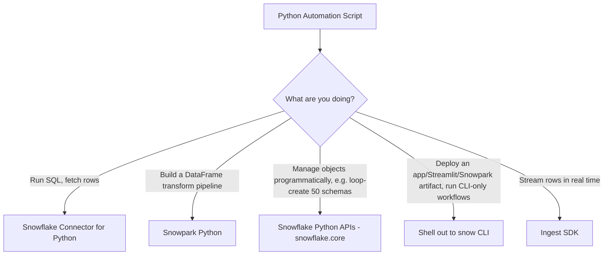

# Snowflake CLI Mastery Guide

## 06 — Python, the Connector, Snowpark, and Automation

> This file covers Python-based access to Snowflake as a **complement** to Snowflake CLI — when to shell out to `snow`, when to use the Python Connector directly, and when to use Snowpark Python. All three are commonly combined in real production automation.

---

## 1. The Python Access Landscape

| Layer | Package | Purpose |
|---|---|---|
| **Snowflake CLI** | `snowflake-cli` (binary `snow`) | Terminal/CI automation, object lifecycle management, project deployment |
| **Snowflake Connector for Python** | `snowflake-connector-python` | Low-level DB-API 2.0 driver — raw SQL execution from Python code |
| **Snowpark Python** | `snowflake-snowpark-python` | DataFrame API — build transformation logic that *pushes down* to Snowflake compute |
| **Snowflake Python APIs (management API)** | `snowflake.core` | Object-oriented Python SDK for managing Snowflake objects (databases, warehouses, tasks) programmatically, without raw SQL strings |
| **Ingest SDK** | `snowflake-ingest` | Programmatic Snowpipe / Snowpipe Streaming ingestion client |



---

## 2. Snowflake Connector for Python

### 2.1 Install

```bash
pip install snowflake-connector-python --break-system-packages
```

### 2.2 Connect Using `connections.toml` (Shared With Snowflake CLI)

```python
import snowflake.connector

conn = snowflake.connector.connect(connection_name="prod")  # reads ~/.snowflake/connections.toml
cur = conn.cursor()
cur.execute("SELECT CURRENT_WAREHOUSE(), CURRENT_ROLE()")
print(cur.fetchall())
conn.close()
```

> **💡 Tip**
> Because Snowflake CLI and the Python Connector share the same `connections.toml`/`config.toml` conventions, a connection you set up once with `snow connection add` is immediately usable from Python with zero extra config — a major reason to standardize on named connections from day one.

### 2.3 Key-Pair Authentication in Python

```python
from cryptography.hazmat.primitives import serialization
import snowflake.connector

with open("/secure/path/snowflake_rsa_key.p8", "rb") as key_file:
    p_key = serialization.load_pem_private_key(key_file.read(), password=None)

private_key_bytes = p_key.private_bytes(
    encoding=serialization.Encoding.DER,
    format=serialization.PrivateFormat.PKCS8,
    encryption_algorithm=serialization.NoEncryption(),
)

conn = snowflake.connector.connect(
    account="myorg-prodaccount",
    user="svc_dbt_prod",
    private_key=private_key_bytes,
    role="TRANSFORMER_PROD",
    warehouse="WH_ELT_PROD",
)
```

### 2.4 Error Handling Pattern

```python
import snowflake.connector
from snowflake.connector.errors import ProgrammingError, DatabaseError

def run_query(sql: str, connection_name: str = "prod"):
    try:
        with snowflake.connector.connect(connection_name=connection_name) as conn:
            with conn.cursor(snowflake.connector.DictCursor) as cur:
                cur.execute(sql)
                return cur.fetchall()
    except ProgrammingError as e:
        # SQL compilation/execution error — log the Snowflake error code for triage
        raise RuntimeError(f"Snowflake SQL error [{e.errno}]: {e.msg}") from e
    except DatabaseError as e:
        # Connectivity/auth error
        raise RuntimeError(f"Snowflake connection error: {e}") from e
```

### 2.5 Batch Inserts (Efficient Pattern)

```python
import snowflake.connector

rows = [(1, "alice"), (2, "bob"), (3, "carol")]

with snowflake.connector.connect(connection_name="prod") as conn:
    with conn.cursor() as cur:
        cur.executemany(
            "INSERT INTO ANALYTICS_PROD.STAGING.USERS (id, name) VALUES (%s, %s)", rows
        )
    conn.commit()
```

> **⚠️ Warning**
> `executemany` with the standard connector still issues row-batched `INSERT` statements — for large volumes (>10K rows), prefer writing to Parquet/CSV and using `PUT` + `COPY INTO`, or use `write_pandas()` (below), both of which are dramatically faster than row-by-row inserts.

### 2.6 `write_pandas` — Fast Bulk Load from a DataFrame

```python
import pandas as pd
from snowflake.connector.pandas_tools import write_pandas
import snowflake.connector

df = pd.read_csv("orders_2026_07_30.csv")

with snowflake.connector.connect(connection_name="prod") as conn:
    success, nchunks, nrows, _ = write_pandas(
        conn, df, table_name="RAW_ORDERS", schema="STAGING", database="ANALYTICS_PROD"
    )
    print(f"Loaded {nrows} rows in {nchunks} chunk(s): {success}")
```

---

## 3. Snowpark Python (DataFrame API — Pushdown Compute)

### 3.1 Install

```bash
pip install snowflake-snowpark-python --break-system-packages
```

### 3.2 Session from a Named Connection

```python
from snowflake.snowpark import Session

session = Session.builder.config("connection_name", "prod").create()

df = session.table("ANALYTICS_PROD.CORE.ORDERS")
result = (
    df.filter(df["STATUS"] == "COMPLETED")
      .group_by("CUSTOMER_ID")
      .agg({"AMOUNT": "sum"})
      .sort("SUM(AMOUNT)", ascending=False)
      .limit(10)
)
result.show()
session.close()
```

**Key property:** the DataFrame operations above compile to a single SQL query and execute **inside Snowflake** — no data is pulled to the Python process until `.collect()`/`.show()`/`.to_pandas()` is called.

### 3.3 Deploying a Snowpark UDF Programmatically (vs. `snow snowpark deploy`)

```python
from snowflake.snowpark.functions import udf
from snowflake.snowpark.types import StringType, VariantType

@udf(name="clean_orders_udf", is_permanent=True, stage_location="@dev_deployment",
     replace=True, packages=["pandas"])
def clean_orders(raw_json: dict) -> dict:
    # transformation logic
    return {**raw_json, "cleaned": True}
```

### Snowpark Python vs. `snow snowpark deploy` — When to Use Which

| DIMENSIONS | `snow snowpark deploy` (CLI, project-defined) | Snowpark Python `@udf`/`@sproc` decorator (in-code) |
|---|---|---|
| Source of truth | `snowflake.yml` — declarative, versioned artifact list | Python code itself defines and registers the object |
| Best for | CI/CD-managed, reviewable deployments of stable UDFs/procs | Ad-hoc registration inside a notebook/interactive session, dynamic pipeline generation |
| Rollback | Redeploy previous Git commit | Manual re-registration |
| Recommended for production | ✅ Yes | ⚠️ Only for interactive/dev use, or wrapped in tested deployment code |

---

## 4. Snowflake Python APIs (`snowflake.core`) — Object Management SDK

```bash
pip install snowflake --break-system-packages   # ships snowflake.core
```

```python
from snowflake.core import Root
from snowflake.core.warehouse import Warehouse
from snowflake.snowpark import Session

session = Session.builder.config("connection_name", "prod").create()
root = Root(session)

# Create a warehouse without hand-writing DDL strings
root.warehouses.create(
    Warehouse(
        name="WH_ADHOC_ANALYSIS",
        warehouse_size="SMALL",
        auto_suspend=60,
        auto_resume=True,
    ),
    mode="if_not_exists",
)

for wh in root.warehouses.iter(like="WH_%"):
    print(wh.name, wh.size, wh.state)
```

### When to Use `snowflake.core` vs. Raw SQL vs. CLI

| DIMENSIONS | `snowflake.core` (Python API) | Raw SQL via Connector | `snow` CLI |
|---|---|---|---|
| Best for | Programmatic, loop-driven object management (e.g., provisioning 200 per-tenant schemas from a config list) | One-off scripts, arbitrary SQL not yet modeled in the API | Terminal/CI-driven, human-readable, version-controlled scripts |
| Type safety | ✅ Typed Python objects | ❌ Raw strings | N/A (declarative YAML for project-based commands) |
| Coverage | Growing but not 100% of all DDL surface | 100% (anything expressible in SQL) | Full command surface, but through subprocess |

---

## 5. Shelling Out to `snow` from Python (Hybrid Pattern)

Common in orchestrators (see `05` §10) when you need CLI-only capabilities from Python code:

```python
import subprocess
import json

def snow_run(args: list[str]) -> str:
    result = subprocess.run(
        ["snow", *args, "--format", "json"],
        capture_output=True, text=True, check=False,
    )
    if result.returncode != 0:
        raise RuntimeError(f"snow command failed ({result.returncode}): {result.stderr}")
    return result.stdout

output = snow_run(["object", "list", "warehouse", "--connection", "prod"])
warehouses = json.loads(output)
for wh in warehouses:
    print(wh["name"], wh["state"])
```

> **✅ Best Practice**
> Always pass `--format json` and parse structured output rather than screen-scraping the default `TABLE` renderer — table formatting (column widths, box-drawing characters) is not a stable contract across CLI versions.

---

## 6. Ingest SDK — Programmatic Snowpipe Streaming

```bash
pip install snowflake-ingest --break-system-packages
```

```python
from snowflake.ingest.streaming import StreamingIngestClient

client = StreamingIngestClient(
    client_name="orders_stream_client",
    db_name="ANALYTICS_PROD",
    schema_name="STAGING",
    pipe_name="PIPE_ORDERS_STREAMING",
    connection_name="prod",
)
channel = client.open_channel(channel_name="orders_channel_1")

row = {"ORDER_ID": 98213, "STATUS": "CREATED", "AMOUNT": 42.50}
channel.insert_row(row, offset_token="98213")
channel.close()
client.close()
```

Used for application-level event streaming into Snowflake at sub-second latency — the terminal counterpart is monitoring via `snow sql` against `PIPE_USAGE_HISTORY` (see `05_Data_Engineering_Workflow.md` §5).

---

## 7. Automation & Testing Best Practices

### 7.1 Structured Logging

```python
import logging

logging.basicConfig(
    level=logging.INFO,
    format="%(asctime)s %(levelname)s %(name)s: %(message)s",
)
logger = logging.getLogger("snowflake_pipeline")

logger.info("Starting load for batch_date=%s", "2026-07-30")
```

### 7.2 Testing Snowpark Logic Locally

```python
# pytest-based unit test using the Local Testing Framework (mocked session)
from snowflake.snowpark import Session
from snowflake.snowpark.mock import MockServerConnection

def test_clean_orders_transform():
    session = Session.builder.config("local_testing", True).create()
    df = session.create_dataframe([{"id": 1, "status": "completed"}])
    result = df.filter(df["status"] == "completed").collect()
    assert len(result) == 1
```

> **💡 Tip**
> Snowpark's Local Testing Framework lets you unit-test transformation logic **without a live Snowflake connection** — essential for fast CI feedback loops. Reserve integration tests against a real (dev) Snowflake account for a smaller, slower test suite.

### 7.3 Retry Logic for Transient Connector Errors

```python
import time
from snowflake.connector.errors import OperationalError

def with_retries(fn, attempts=3, backoff_seconds=2):
    last_err = None
    for attempt in range(1, attempts + 1):
        try:
            return fn()
        except OperationalError as e:
            last_err = e
            logger.warning("Transient error on attempt %d/%d: %s", attempt, attempts, e)
            time.sleep(backoff_seconds * attempt)
    raise last_err
```

---

## 8. SDK/Tool Comparison Summary

| Tool | Language surface | Pushdown compute | CI/Terminal friendly | Object lifecycle mgmt | Best fit |
|---|---|---|---|---|---|
| Snowflake CLI (`snow`) | Shell/YAML | N/A (executes SQL/artifacts) | ✅✅✅ | ✅ Full (via project defs) | Deployment, DevOps, automation glue |
| Connector for Python | Python (DB-API) | ❌ (client pulls results) | ⚠️ Needs a Python runtime | ❌ (raw SQL only) | Custom app integration, ETL scripts |
| Snowpark Python | Python (DataFrame) | ✅✅✅ | ⚠️ Needs a Python runtime | ⚠️ Partial (UDF/proc registration) | Data engineering/ML pipelines expressed as code |
| `snowflake.core` | Python (typed objects) | N/A | ⚠️ Needs a Python runtime | ✅ Growing coverage | Programmatic infra provisioning |
| REST API (SQL API) | HTTP/JSON | N/A | ✅ (any HTTP client) | ⚠️ Partial | Language-agnostic integrations, lightweight services |

### 8.1 REST API Note

Snowflake also exposes a **SQL REST API** (`https://<account>.snowflakecomputing.com/api/v2/statements`) for language-agnostic HTTP-based execution — useful when neither the CLI nor a Python runtime is available (e.g., calling Snowflake from a lightweight serverless function in Go or Node.js). Authentication uses the same key-pair/OAuth mechanisms as the CLI and Connector.

---

Continue to **`07_Project_Examples.md`** for complete, real-world terminal workflows tying all of this together.