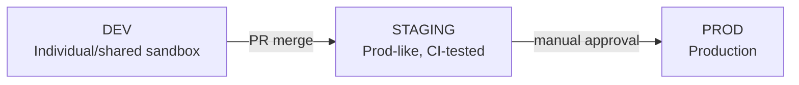
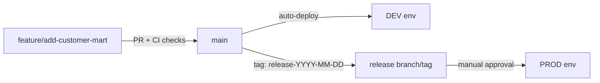

# Snowflake CLI Mastery Guide

## 08 — Enterprise Best Practices

---

## 1. Repository & Folder Structure

### 1.1 Monorepo Pattern (Recommended for Most Teams)

```
data-platform/
├── .github/workflows/              # CI/CD pipeline definitions
│   ├── ci-pr-checks.yml
│   ├── deploy-dev.yml
│   └── deploy-prod.yml
├── account-admin/                  # warehouses, roles, users, resource monitors (see 04)
│   ├── warehouses/
│   ├── roles/
│   ├── users/
│   └── governance/
├── pipelines/                      # stage/pipe/task/stream/dynamic table definitions
│   ├── ingestion/
│   └── transformation/
├── dbt_project/                    # dbt models, tests, docs
│   ├── models/
│   ├── tests/
│   └── dbt_project.yml
├── snowpark/                       # Snowpark UDFs/procedures
│   └── snowflake.yml
├── streamlit_apps/
│   └── sales_dashboard/
│       └── snowflake.yml
├── native_apps/
│   └── inventory_app/
│       └── snowflake.yml
├── migrations/                     # versioned, numbered DDL migrations
│   ├── V001__init.sql
│   └── V002__add_orders.sql
├── config.toml.example             # sanitized connection template (never the real file)
├── .gitignore                      # MUST include config.toml, *.p8, *.pem
└── README.md
```


### 1.2 Polyrepo Pattern (Large Orgs, Independent Release Cadences)


| Repo                 | Owns                                                             |
| -------------------- | ---------------------------------------------------------------- |
| `platform-admin`     | Account-level objects, RBAC, resource monitors, network policies |
| `analytics-dbt`      | dbt project (transformation logic)                               |
| `snowpark-functions` | Reusable UDFs/procedures, deployed independently                 |
| `app-<name>`         | One repo per Native App or Streamlit app                         |


> **✅ Best Practice**
> Start with a monorepo. Split into polyrepo **only** when independent teams need independent release cadences and CODEOWNERS-based access control becomes unwieldy in a single repo — premature polyrepo splitting adds CI/versioning overhead most teams don't need yet.

---


## 2. Naming Conventions


| Object           | Convention                   | Example                                |
| ---------------- | ---------------------------- | -------------------------------------- |
| Database         | `<DOMAIN>_<ENV>`             | `ANALYTICS_PROD`, `ANALYTICS_DEV`      |
| Schema           | `<LAYER>`                    | `STAGING`, `CORE`, `MARTS`             |
| Warehouse        | `WH_<PURPOSE>_<ENV>`         | `WH_ELT_PROD`, `WH_BI_DEV`             |
| Access Role      | `AR_<DOMAIN>_<PRIVILEGE>`    | `AR_ANALYTICS_PROD_READ`               |
| Functional Role  | `FR_<FUNCTION>`              | `FR_DATA_ENGINEER`                     |
| Service User     | `SVC_<SYSTEM>_<ENV>`         | `SVC_DBT_PROD`                         |
| Connection (CLI) | `<env>` or `<env>_<purpose>` | `dev`, `prod`, `prod_admin`            |
| Task             | `TASK_<ACTION>_<OBJECT>`     | `TASK_REFRESH_CUSTOMERS`               |
| Stream           | `STRM_<SOURCE>`              | `STRM_RAW_ORDERS`                      |
| Stage            | `<SCOPE>_<PURPOSE>`          | `EXT_RAW_LANDING`, `INT_MANUAL_UPLOAD` |
| Migration file   | `V<NNN>__<description>.sql`  | `V004__backfill_amount_currency.sql`   |


> **✅ Best Practice**
> Bake the environment into the **database name**, not the connection alone. `ANALYTICS_PROD` vs. `ANALYTICS_DEV` as distinct databases (rather than one `ANALYTICS` database accessed via different roles) prevents an accidental `--connection dev` typo from touching production data — the blast radius of a wrong connection is contained by RBAC *and* by namespace.

---


## 3. Environment Management


### 3.1 Three-Tier Model




| Environment | Connection name                 | Refresh cadence                              | Who can deploy                                    |
| ----------- | ------------------------------- | -------------------------------------------- | ------------------------------------------------- |
| DEV         | `dev` (per-developer or shared) | On demand                                    | Any engineer, direct `snow` commands              |
| STAGING     | `staging`                       | Nightly clone from PROD (`CREATE ... CLONE`) | CI only, on PR merge to `main`                    |
| PROD        | `prod`                          | N/A                                          | CI only, on tag/release with manual approval gate |


```bash
# Nightly staging refresh via zero-copy clone
snow sql --connection admin -q "
CREATE OR REPLACE DATABASE ANALYTICS_STAGING CLONE ANALYTICS_PROD;
"
```


### 3.2 Connection-per-Environment, Never Shared Credentials

- Each environment gets its **own** service user, its **own** key pair, and its **own** named connection.
- Never reuse a `prod` credential for `dev` testing "just this once."

---


## 4. Security & Credential Management


| Practice                                                                                          | Rationale                                                                       |
| ------------------------------------------------------------------------------------------------- | ------------------------------------------------------------------------------- |
| Key-pair auth for all service accounts                                                            | No password to leak; supports rotation without downtime (see `04` §5)           |
| `chmod 600` on private keys and `config.toml`                                                     | OS-level enforcement against other local users                                  |
| `--temporary-connection` in CI                                                                    | No config file with embedded secrets ever touches the repo or CI cache          |
| Secrets stored in CI secret manager (GitHub Secrets, Azure Key Vault, etc.), injected as env vars | Centralized rotation, audit trail                                               |
| Network policies scoped to CI runner egress IPs + corporate VPN                                   | Reduces blast radius of a leaked credential                                     |
| Separate `DEPLOYER` role from human `SYSADMIN`/`ACCOUNTADMIN`                                     | Least privilege — CI can deploy schema objects but shouldn't manage users/roles |
| `.gitignore` includes `config.toml`, `*.p8`, `*.pem`, `connections.toml`                          | Prevents accidental credential commits                                          |
| Pre-commit hook scanning for embedded secrets (e.g., `gitleaks`, `truffleHog`)                    | Defense in depth against human error                                            |


> **⚠️ Warning**
> Never pass `--password` on the command line, even in a "throwaway" local script — shell history (`~/.bash_history`, `~/.zsh_history`) persists plaintext. Prefer key-pair auth or an interactive prompt (`snow connection add` without `--password`).

---


## 5. Git Workflow


### 5.1 Branching Model




| Branch/Tag      | Deploys to                                                                        |
| --------------- | --------------------------------------------------------------------------------- |
| `feature/*`     | Nothing automatic — `snow` commands run locally against personal `dev` connection |
| `main`          | Auto-deploy to shared `DEV`/`STAGING` on merge                                    |
| `release-*` tag | `PROD`, gated by manual approval in CI                                            |


### 5.2 PR Checks (CI)

```yaml
# .github/workflows/ci-pr-checks.yml (excerpt)
jobs:
  validate:
    steps:
      - run: snow app validate --connection ci_validate      # Native App manifest validation
      - run: snow sql -f migrations/latest.sql --connection ci_validate --enhanced-exit-codes --local-only
      - run: dbt compile   # or: snow dbt execute compile
      - run: sqlfluff lint migrations/ --dialect snowflake
```


### 5.3 Code Review Checklist for Snowflake Changes

- [ ] Migration is idempotent (`IF NOT EXISTS` / `CREATE OR REPLACE` used deliberately, not accidentally)
- [ ] Destructive statements (`DROP`, `DELETE`, `TRUNCATE`) are explicitly called out in the PR description
- [ ] New service accounts use `TYPE = SERVICE` and key-pair auth
- [ ] New roles follow the access-role/functional-role separation (see `04` §4)
- [ ] Resource-intensive warehouses have `AUTO_SUSPEND` and a resource monitor
- [ ] PII columns get a masking policy or tag
- [ ] Rollback/down-migration script is included for schema changes

---


## 6. CI/CD Conventions


| Convention                                            | Detail                                                                                                                     |
| ----------------------------------------------------- | -------------------------------------------------------------------------------------------------------------------------- |
| One pipeline stage per environment                    | `deploy-dev.yml`, `deploy-staging.yml`, `deploy-prod.yml` — never one script with an `if env == prod` branch buried inside |
| `--enhanced-exit-codes` everywhere                    | Lets CI distinguish "bad SQL" (5) from "bad CLI invocation" (2) from infra failures (1) for better alerting/triage         |
| `--single-transaction` for multi-statement migrations | All-or-nothing application                                                                                                 |
| Explicit manual approval gate before PROD             | GitHub Environments / Azure DevOps approvals — no fully-automatic prod deploys for schema-altering changes                 |
| Post-deploy smoke test                                | A trivial `snow sql -q "SELECT 1"` plus a row-count sanity check against a known table                                     |
| Immutable, pinned CLI version in CI                   | Pin `cli-version` in the CI action — don't float on `latest` for reproducible deploys                                      |


---


## 7. Testing Strategy


| Layer                 | Tool                                                             | What it catches                                        |
| --------------------- | ---------------------------------------------------------------- | ------------------------------------------------------ |
| SQL linting           | `sqlfluff` (Snowflake dialect)                                   | Style, common anti-patterns                            |
| Snowpark unit tests   | Local Testing Framework (`snowflake-snowpark-python[localtest]`) | Transformation logic bugs, no live connection needed   |
| dbt tests             | `dbt test` / `snow dbt execute test`                             | Data quality (not_null, unique, relationships, custom) |
| Integration tests     | `snow sql` against an ephemeral cloned DB                        | End-to-end pipeline correctness                        |
| Native App validation | `snow app validate`                                              | Manifest/setup script errors before deploy             |
| Cost/perf regression  | `WAREHOUSE_METERING_HISTORY` query post-deploy                   | Catch a migration that 10x'd a warehouse's credit burn |


---


## 8. Monitoring, Logging & Observability

```bash
# Task failure alerting query (run on a schedule, e.g. via an external cron + snow sql)
snow sql --connection prod --format json -q "
SELECT name, state, error_message, scheduled_time
FROM TABLE(INFORMATION_SCHEMA.TASK_HISTORY(
  SCHEDULED_TIME_RANGE_START => DATEADD('hour', -1, CURRENT_TIMESTAMP())))
WHERE state = 'FAILED';
"
```


| Signal                            | Source                                                | Recommended action                                                           |
| --------------------------------- | ----------------------------------------------------- | ---------------------------------------------------------------------------- |
| Task failures                     | `TASK_HISTORY`                                        | Alert to PagerDuty/Slack via a wrapper script parsing `--format json` output |
| Pipe backlog                      | `SYSTEM$PIPE_STATUS`, `PIPE_USAGE_HISTORY`            | Alert if `pendingFileCount` grows unbounded                                  |
| Warehouse spend                   | `WAREHOUSE_METERING_HISTORY`, resource monitors       | Weekly cost review; resource monitor `SUSPEND` as hard stop                  |
| Query performance regressions     | `QUERY_HISTORY` (bytes_scanned, execution_time trend) | Automated regression check in CI against staging                             |
| Service/container health          | `snow spcs service status`, `snow spcs service logs`  | Wire into existing container observability stack                             |
| CLI-driven deployment audit trail | CI job logs + `snow` command history                  | Retain CI logs per compliance retention policy                               |


> **✅ Best Practice**
> Centralize Snowflake object-level logs (`EVENT_TABLE` for Snowpark/SPCS telemetry) and forward them to your existing observability stack (Datadog, Splunk) rather than building a bespoke Snowflake-only dashboard — `snow logs` and `snow spcs service logs` are for point-in-time terminal debugging, not long-term retention.

---


## 9. Performance Tuning Checklist

- [ ] Right-size warehouses per workload (see `04` §3 sizing table) — don't default everything to `MEDIUM`.
- [ ] Use multi-cluster warehouses for **concurrency**, not larger single-cluster size for **throughput** of many small concurrent queries.
- [ ] Set `AUTO_SUSPEND` aggressively (60s) on ELT warehouses; only BI/interactive warehouses may warrant longer suspend windows to avoid cold-start latency for end users.
- [ ] Use `TARGET_LAG` on Dynamic Tables that matches actual freshness SLAs — an unnecessarily tight lag (e.g., `1 minute` when 1 hour suffices) burns credits.
- [ ] Cluster large, frequently-filtered tables on the CLI-scriptable `ALTER TABLE ... CLUSTER BY` key that matches common `WHERE`/join predicates.
- [ ] Batch `snow stage copy` uploads (many small files) rather than issuing one CLI invocation per file — file listing/PUT overhead adds up in loops.
- [ ] Avoid `SELECT *` in production Snowpark/dbt models — column pruning reduces bytes scanned and compute cost.

---


## 10. Summary: The Enterprise-Grade `snow` Checklist


| ✅   | Practice                                                                |
| --- | ----------------------------------------------------------------------- |
| ☐   | Key-pair auth for every non-human account                               |
| ☐   | `config.toml`/keys excluded from Git, `chmod 600` enforced              |
| ☐   | Environment baked into database naming, not just role/connection        |
| ☐   | Access-role / functional-role RBAC separation                           |
| ☐   | Resource monitors on every non-trivial warehouse                        |
| ☐   | `--enhanced-exit-codes` + `--single-transaction` in all CI deploy steps |
| ☐   | Manual approval gate before any PROD-affecting CI job                   |
| ☐   | Rollback script paired with every schema migration                      |
| ☐   | Monitoring wired for Task failures, pipe backlog, and warehouse spend   |
| ☐   | `snow --version` pinned explicitly in CI, not `latest`                  |


---

Continue to `09_Troubleshooting.md` for common errors and fixes.