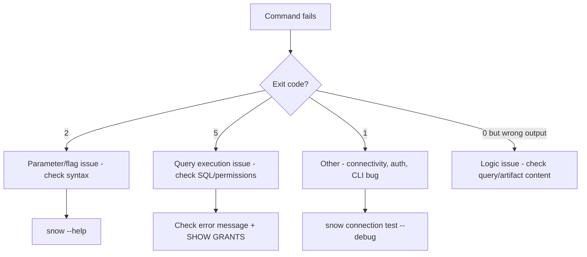

# Snowflake CLI Mastery Guide

## 09 — Troubleshooting

---

## 1. Diagnostic-First Workflow

Before digging into specific errors, always gather context:

```bash
snow --info                                    # CLI version, Python version, config path
snow connection test --connection <name> --debug   # verbose connection diagnostics
snow sql -q "SELECT 1" --connection <name> --enhanced-exit-codes --debug
echo $?                                        # inspect the exit code
```



---

## 2. Connection & Authentication Errors

### 2.1 `Could not connect to Snowflake backend`

```
Invalid connection configuration
000606: 250001: Could not connect to Snowflake backend after 0 attempt(s)
```

**Causes & Fixes**

| Cause | Fix |
|---|---|
| Wrong account identifier format | Use `orgname-accountname` (current recommended format), not a stale locator |
| No network egress to `*.snowflakecomputing.com` | Check corporate proxy/firewall; configure `HTTPS_PROXY` env var if required |
| Typo in `config.toml` | `snow connection list --format json` to inspect resolved values |
| Account suspended/paused (trial) | Verify account status in Snowsight org view |

### 2.2 `JWT token is invalid` / Key-Pair Auth Failure

```
250001: Could not connect to Snowflake backend.
Invalid JWT token.
```

| Cause | Fix |
|---|---|
| Public key not registered on the user | `ALTER USER <user> SET RSA_PUBLIC_KEY='...'` and verify with `DESC USER <user>` |
| Private key file path wrong/unreadable | Check `private_key_file` path and `chmod 600` |
| Key rotated but old key still referenced | Confirm which of `RSA_PUBLIC_KEY` / `RSA_PUBLIC_KEY_2` is currently active |
| Encrypted key without passphrase set | Set `PRIVATE_KEY_PASSPHRASE` environment variable |
| Clock skew on the client machine | JWTs are time-bound; sync system clock (NTP) |

### 2.3 `config.toml` Permission Error

```
Error: Config file has too broad permissions.
```
**Fix:**
```bash
chmod 0600 ~/.snowflake/config.toml
```

### 2.4 MFA Prompt Blocking Automation

```
Error: MFA passcode required.
```
**Fix:** For service accounts, switch to key-pair auth (`SNOWFLAKE_JWT`) — MFA should never be required for non-interactive automation. For genuinely interactive use, pass `--mfa-passcode <code>` or use a Duo push-approved session.

---

## 3. SQL Execution Errors

### 3.1 `Invalid parameter combination`

```
snow sql --enhanced-exit-codes -q 'select 1' -f my.query
```
```
Error: Cannot use --query and --filename together.
```
**Fix:** Use exactly one of `-q`, `-f`, `-i` per invocation.

### 3.2 SQL Compilation Error (Exit Code 5)

```
╭─ Error ─────────────────────────────────────────────────────────╮
│ 002003 (42S02): SQL compilation error:                         │
│ Object 'ANALYTICS_DEV.CORE.ORDRS' does not exist or not         │
│ authorized.                                                     │
╰──────────────────────────────────────────────────────────────────╯
```

| Likely cause | Fix |
|---|---|
| Typo in object name | Check spelling (`ORDRS` vs. `ORDERS`) |
| Wrong database/schema context | Confirm `--database`/`--schema` or connection defaults |
| Missing privilege | `SHOW GRANTS TO ROLE <current_role>` — grant `SELECT`/`USAGE` as needed |
| Object exists but in a different case-sensitive identifier | Snowflake unquoted identifiers are case-insensitive (stored uppercase) — quoted identifiers preserve case; check for accidental quoting upstream |

### 3.3 `$$` Scripting Block Fails Inline

```
snow sql -q "EXECUTE IMMEDIATE $$ ... $$"
```
```
zsh: bad substitution
```
**Fix:** Escape delimiters (`\$\$`) or, preferably, place the script in a `.sql` file and use `-f`.

### 3.4 Special Characters Misinterpreted by Shell

```bash
snow sql -q "SELECT SYSTEM$CLIENT_VERSION_INFO()"
```
```
zsh: no matches found
```
**Fix:** Use single quotes, or escape the `$`:
```bash
snow sql -q 'SELECT SYSTEM$CLIENT_VERSION_INFO()'
```

### 3.5 Transaction Rolled Back Silently

**Symptom:** `--single-transaction` job "succeeds" per exit code but data isn't present.
**Cause:** A later statement in the batch failed, rolling back the entire transaction — check full output, not just the exit code, for a `╭─ Error ─╮` block partway through.
**Fix:** Always log full `stdout`/`stderr` in CI, not just the return code, and grep for `Error` blocks.

---

## 4. Object Deployment Errors (`snow app`, `snow streamlit`, `snow snowpark`)

### 4.1 `Artifact not found` During Deploy

```
Error: Artifact 'streamlit_app.py' referenced in snowflake.yml not found.
```
**Fix:** Verify `artifacts:` paths in `snowflake.yml` are relative to the project root (or the path passed to `--project`), and that you're running the command from the correct working directory (or passing `-p`/`--project` explicitly).

### 4.2 Native App: `Setup script failed`

```
Error: Application creation failed.
SQL compilation error in setup_script.sql at line 14.
```
**Fix:** Run `snow app validate --connection dev` first — it lints the manifest and setup script without a full deploy, surfacing the same error faster and without leaving partial objects behind.

### 4.3 Snowpark Package Not Found on Anaconda Channel

```
002128 (42710): Package 'my-internal-lib' is not available.
```
**Fix:**
```bash
snow snowpark package lookup my-internal-lib   # confirm it's genuinely unavailable
snow snowpark package create my-internal-lib
snow snowpark package upload my-internal-lib.zip @dev_deployment/packages/
```
Then reference it as a stage-based `IMPORTS` entry rather than a `packages:` Anaconda dependency in `snowflake.yml`.

### 4.4 Stale Deployment (Old Code Still Running)

**Symptom:** Code changes don't appear to take effect after `snow snowpark deploy`.
**Cause:** UDF/procedure caching, or deploying to the wrong connection/schema.
**Fix:**
```bash
snow snowpark describe CLEAN_ORDERS_UDF --connection dev   # confirm last-modified timestamp
snow snowpark deploy --project . --connection dev --replace  # force replace if supported by your version
```

---

## 5. Stage & File Transfer Errors

### 5.1 `File not found` on Upload

```
snow stage copy ./data/*.csv @raw_landing/
```
```
Error: No files matched pattern './data/*.csv'
```
**Fix:** Confirm the glob resolves in your current shell (`ls ./data/*.csv`); relative paths are resolved from the CLI's current working directory, not the project root.

### 5.2 Missing `@` Prefix

```
snow stage list-files raw_landing
```
```
Error: 'raw_landing' is not a valid stage reference.
```
**Fix:** `snow stage list-files @raw_landing`

### 5.3 `COPY INTO` Loads 0 Rows Despite Files Present

| Cause | Fix |
|---|---|
| Files already loaded (Snowflake tracks load history per pipe/table by default for 64 days) | Use `FORCE = TRUE` deliberately (understand duplicate-load risk) or query `COPY_HISTORY` to confirm prior load |
| `FILE_FORMAT` mismatch (e.g., wrong delimiter) | `LIST @stage` + manually inspect a sample file; test format with a `SELECT` from stage: `SELECT $1 FROM @stage/file.csv (FILE_FORMAT => 'ff_name') LIMIT 5;` |
| Path pattern doesn't match staged prefix | `snow stage list-files @stage/prefix/` to confirm the exact path before referencing it in `COPY INTO` |

---

## 6. Snowpipe & Ingestion Errors

### 6.1 Pipe Not Auto-Ingesting

```bash
snow sql -q "SELECT SYSTEM\$PIPE_STATUS('MY_PIPE');"
```
```json
{"executionState":"PAUSED_REQUESTED_BY_USER" ...}
```
**Fix:**
```bash
snow sql -q "ALTER PIPE MY_PIPE RESUME;"
```

### 6.2 Files Landing But Not Loading

| Cause | Fix |
|---|---|
| Notification integration misconfigured (no S3 event → SQS delivery) | Verify SQS queue ARN matches `NOTIFICATION_CHANNEL`; check cloud-side event notification config on the bucket |
| IAM role trust relationship broken | Re-run `DESC STORAGE INTEGRATION` / `DESC NOTIFICATION INTEGRATION` and re-verify the trust policy matches the current `STORAGE_AWS_EXTERNAL_ID` |
| Pipe pointing at wrong stage prefix | `SHOW PIPES` and confirm the `definition` matches the actual landing path |

---

## 7. Task, Stream & Dynamic Table Errors

### 7.1 Task Not Running

```bash
snow sql -q "SHOW TASKS LIKE 'TASK_REFRESH_CUSTOMERS';"
```
```
+---------------------------------------------------------------+
| name                     | state    | ...                     |
|---------------------------|----------|-------------------------|
| TASK_REFRESH_CUSTOMERS    | suspended| ...                     |
+---------------------------------------------------------------+
```
**Fix:** Tasks are created **suspended** by default.
```bash
snow sql -q "ALTER TASK TASK_REFRESH_CUSTOMERS RESUME;"
```
Also check that the **root task** in a DAG is resumed — child tasks resume independently but won't fire without the root scheduled trigger active.

### 7.2 Dynamic Table Stuck / Not Refreshing

```bash
snow sql -q "SELECT * FROM TABLE(INFORMATION_SCHEMA.DYNAMIC_TABLE_REFRESH_HISTORY(
  NAME=>'CUSTOMER_360'));" --format json
```
Look for `refresh_action = 'NO_DATA'` (expected, harmless) vs. `state = 'FAILED'` with an error message — usually an underlying source table permission or schema-drift issue.

### 7.3 Stream Went Stale (`STALE = TRUE`)

**Cause:** Stream offset exceeded the base table's `DATA_RETENTION_TIME_IN_DAYS` without being consumed.
**Fix:** Increase retention on the base table, or consume the stream more frequently; a stale stream must be recreated and will lose unconsumed change data.

---

## 8. CI/CD-Specific Errors

### 8.1 Works Locally, Fails in CI

**Checklist:**
1. `snow --version` — is the same CLI version installed in CI as local?
2. `snow --info` — does `default_config_file_path` resolve as expected inside the CI container?
3. Is `--temporary-connection` being used, or is CI accidentally reading a stray `config.toml` from a previous cached step?
4. Are secrets actually populated (`echo "${SNOWFLAKE_ACCOUNT:+set}"` — never echo the actual secret)?

### 8.2 `enhanced-exit-codes` Not Differentiating Errors

**Cause:** Forgot to set the flag, or relying on the `SNOWFLAKE_ENHANCED_EXIT_CODES` env var not being propagated into a subshell/container step.
**Fix:** Explicitly pass `--enhanced-exit-codes` per invocation rather than relying on inherited environment state across CI step boundaries.

### 8.3 Timeout in Long-Running CI Deploy

**Cause:** A `snow dbt execute run` or large `COPY INTO` exceeds the CI job's default timeout.
**Fix:** Increase the CI job timeout explicitly; for very long transformations, consider decoupling the trigger (CI submits the job asynchronously) from the wait/poll step.

---

## 9. SPCS Errors

### 9.1 Service Stuck in `PENDING`

```bash
snow spcs service status inference_svc --connection dev
```
```
+---------------------------------------------------------------+
| name          | status  | message                             |
|---------------|---------|--------------------------------------|
| inference_svc | PENDING | Waiting for compute pool capacity     |
+---------------------------------------------------------------+
```
**Fix:** Check compute pool `max-nodes` isn't already saturated:
```bash
snow spcs compute-pool status ml_pool --connection dev
```
Scale up `max-nodes` or wait for other services to release capacity.

### 9.2 Image Pull Failure

```bash
snow spcs service logs inference_svc --connection dev
```
```
Failed to pull image: unauthorized
```
**Fix:**
```bash
snow spcs image-registry login --connection dev   # re-authenticate Docker
docker push <repo_url>/my_app:latest
```
Confirm the compute pool's role has `READ` on the image repository.

---

## 10. General Debugging Toolkit

| Tool | Use |
|---|---|
| `--debug` | Full connector-level HTTP/auth trace |
| `--format json` + `jq`/`python -m json.tool` | Structured inspection of output instead of parsing table text |
| `SHOW GRANTS TO ROLE <role>` / `SHOW GRANTS ON <object>` | Diagnose permission errors |
| `QUERY_HISTORY` view (`ACCOUNT_USAGE` or `INFORMATION_SCHEMA`) | Find the exact failed query ID and full error context |
| `snow connection test --debug` | Isolate connectivity from query-logic issues |
| `cli.logs` section in `config.toml` | Persist CLI logs to disk (`path = "~/.snowflake/logs"`) for post-hoc CI artifact collection |

```toml
[cli.logs]
save_logs = true
level = "debug"
path = "/home/jdoe/.snowflake/logs"
```

> **💡 Tip**
> In CI, upload the `cli.logs` directory as a build artifact on failure (`actions/upload-artifact` in GitHub Actions) — it turns "works on my machine" debugging sessions into a five-minute log review.

---

Continue to **`10_Command_Cheat_Sheet.md`** for the one-page quick reference.