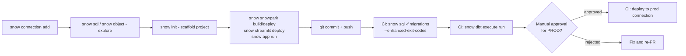

# Snowflake CLI Mastery Guide

## 10 — Command Cheat Sheet

> One-page quick reference. For full detail, see `03_All_Snowflake_CLI_Commands.md`.

---

## 1. Setup

```bash
snow --version                              # check version
snow --info                                 # diagnostics (config path, Python, OS)
snow connection add                         # interactive: add a connection
snow connection add --connection-name ci --account ORG-ACCT --user svc --role DEPLOYER --no-interactive
snow connection list                        # list connections
snow connection test -c <name>              # test a connection
snow connection set-default <name>          # change default
snow --install-completion                   # shell autocompletion
```

---

## 2. SQL Execution

```bash
snow sql -q "SELECT 1"                      # inline query
snow sql -f file.sql                        # run a file
snow sql -f a.sql -f b.sql -f c.sql          # run multiple files, in order, one session
cat q.sql | snow sql -i                      # pipe from stdin
snow sql                                    # interactive REPL
snow sql -q "..." -D "db=DEV"               # templated: <% db %>
snow sql -f m.sql --single-transaction       # all-or-nothing
snow sql -q "..." --format json              # JSON output (nested)
snow sql -q "..." --format JSON_EXT           # JSON output (stringified fallback)
snow sql -q "..." --enhanced-exit-codes       # 0/2/5/1 exit codes
```

---

## 3. Objects (Generic)

```bash
snow object list <type> --like "PATTERN%"
snow object list table --in schema DB.SCHEMA
snow object describe warehouse WH_NAME
snow object drop table DB.SCHEMA.TABLE
snow object create warehouse name=WH_X warehouse_size=SMALL
```

---

## 4. Stages & Files

```bash
snow stage create @my_stage
snow stage list
snow stage list-files @my_stage/prefix/
snow stage copy ./local/*.csv @my_stage/prefix/     # upload
snow stage copy @my_stage/prefix/ ./local/            # download
snow stage remove @my_stage/prefix/file.csv
snow stage execute @my_stage/deploy.sql
```

---

## 5. Snowpark

```bash
snow snowpark build
snow snowpark deploy
snow snowpark execute function "MY_UDF(1,2)"
snow snowpark list
snow snowpark describe MY_UDF
snow snowpark drop MY_UDF
snow snowpark package lookup <pkg>
snow snowpark package create <pkg>
snow snowpark package upload <pkg>.zip @stage/
```

---

## 6. Streamlit

```bash
snow streamlit deploy
snow streamlit list
snow streamlit get-url <name>
snow streamlit logs <name>
snow streamlit share <name> --role <role>
snow streamlit drop <name>
```

---

## 7. Notebooks

```bash
snow notebook create <name>.ipynb
snow notebook deploy <name>.ipynb
snow notebook execute <NAME>
snow notebook get-url <NAME>
snow notebook open <NAME>
snow object list notebook          # no dedicated "notebook list" command
```

---

## 8. Native Apps

```bash
snow app setup                     # scaffold snowflake.yml
snow app run                       # bundle + deploy + create/upgrade (dev loop)
snow app open
snow app validate
snow app version create v1_0_0
snow app release-directive set --version v1_0_0 --patch 0 --channel DEFAULT
snow app events
snow app teardown                  # ⚠️ destructive
```

---

## 9. Git Integration

```bash
snow git setup <repo_name>
snow git fetch @<repo_name>
snow git list-branches <repo_name>
snow git list-tags <repo_name>
snow git list-files "@<repo_name>/branches/main/"
snow git copy "@<repo_name>/branches/main/*" ./local/
snow git execute "@<repo_name>/branches/main/deploy.sql"
snow git drop <repo_name>
```

---

## 10. SPCS (Containers)

```bash
# Registry
snow spcs image-registry login
snow spcs image-registry url

# Repository
snow spcs image-repository create <repo>
snow spcs image-repository url <repo>
snow spcs image-repository list-images <repo>

# Compute Pool
snow spcs compute-pool create <pool> --family CPU_X64_XS --min-nodes 1 --max-nodes 3
snow spcs compute-pool status <pool>
snow spcs compute-pool suspend <pool>
snow spcs compute-pool resume <pool>

# Service
snow spcs service create <svc> --compute-pool <pool> --spec-path spec.yaml
snow spcs service status <svc>
snow spcs service logs <svc>
snow spcs service list-endpoints <svc>
snow spcs service execute-job <job> --compute-pool <pool> --spec-path job.yaml
snow spcs service drop <svc>
```

---

## 11. dbt / DCM

```bash
# dbt
snow dbt deploy <project> --path ./dbt_project
snow dbt execute run <project>
snow dbt execute test <project> --select "tag:critical"
snow dbt list

# DCM (requires enable_snowflake_projects feature flag)
snow dcm plan --target DEV --from ./infra
snow dcm deploy --target PROD --from ./infra
snow dcm preview --from ./infra
snow dcm list-deployments <project>
snow dcm purge <project>
```

---

## 12. Cortex AI

```bash
snow cortex complete "prompt text" --model llama3.1-70b
snow cortex summarize "long text..."
snow cortex translate "text" --from en --to es
snow cortex sentiment "text"
snow cortex extract-answer "question" "context passage"
```

---

## 13. Misc

```bash
snow custom-image validate ./Dockerfile --scan-vulnerabilities
snow logs --object-type function --object-name MY_UDF --since "1 hour"
snow helpers import-snowsql-connections
snow helpers v1-to-v2 --project ./legacy
snow init my_project --template-name <template>
```

---

## 14. Global Flags (Work on Nearly Every Command)

| Flag | Purpose |
|---|---|
| `-c, --connection <name>` | Named connection to use |
| `-x, --temporary-connection` | Bypass config file, use CLI-passed creds |
| `--format TABLE\|JSON\|JSON_EXT\|CSV` | Output format |
| `-p, --project <path>` | Project directory (`snowflake.yml`) |
| `--env key=value` | Override project template variables |
| `-v, --verbose` | Info-level logs |
| `--debug` | Debug-level logs (connector HTTP trace) |
| `--silent` | Suppress intermediate output |
| `--enhanced-exit-codes` | Distinct exit codes: 0 ok / 2 param err / 5 query err / 1 other |
| `--help` | Command help |

---

## 15. Authentication Flags

| Flag | Purpose |
|---|---|
| `--account` | Account identifier (`org-account`) |
| `--user` | Username |
| `--password` | Password (avoid in scripts/CI) |
| `--authenticator SNOWFLAKE_JWT\|EXTERNALBROWSER\|OAUTH` | Auth method |
| `--private-key-file` | Path to key-pair private key |
| `--role` | Role to use |
| `--warehouse` | Warehouse to use |
| `--database` / `--schema` | Default DB/schema |
| `--mfa-passcode` | Duo passcode for interactive MFA |
| `--token` / `--token-file-path` | OAuth/PAT token |
| `--workload-identity-provider AWS\|AZURE\|GCP\|OIDC` | Keyless cloud identity federation |

---

## 16. Exit Code Reference (`--enhanced-exit-codes`)

| Code | Meaning |
|---|---|
| `0` | Success |
| `2` | Command parameter/flag issue |
| `5` | Query execution error |
| `1` | Other error (connectivity, auth, unexpected) |

---

## 17. Workflow Diagram: Typical Dev-to-Prod Loop



---

## 18. Emergency Commands

```bash
snow sql -q "UNDROP TABLE <name>;"                          # recover a dropped table (Time Travel window)
snow sql -q "ALTER TASK <name> SUSPEND;"                    # stop a runaway task
snow sql -q "SELECT SYSTEM\$CANCEL_QUERY('<query_id>');"     # cancel a running query
snow spcs compute-pool stop-all <pool>                       # force-stop all services on a pool
snow sql -q "ALTER WAREHOUSE <wh> SUSPEND;"                  # stop billing immediately
snow app teardown --connection <env>                         # ⚠️ drops app + package
```

---

*End of Snowflake CLI Mastery Guide (Files 01–10). Return to `01_Introduction.md` for the full table of contents.*